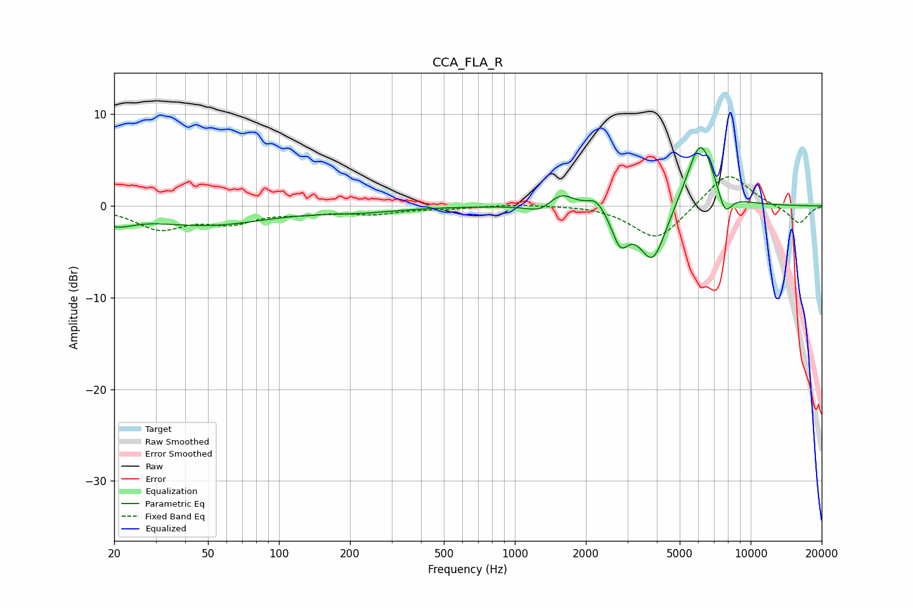

# CCA_FLA_R
See [usage instructions](https://github.com/jaakkopasanen/AutoEq#usage) for more options and info.

### Parametric EQs
Apply preamp of -6.5 dB when using parametric equalizer.

|   # | Type    |   Fc (Hz) |    Q |   Gain (dB) |
|-----|---------|-----------|------|-------------|
|   1 | Peaking |        20 | 1.84 |        -1.4 |
|   2 | Peaking |        49 | 0.56 |        -2   |
|   3 | Peaking |       223 | 0.84 |        -0.5 |
|   4 | Peaking |      1298 | 2.59 |        -1   |
|   5 | Peaking |      1561 | 2.52 |         1.7 |
|   6 | Peaking |      2211 | 3.75 |         1.3 |
|   7 | Peaking |      2800 | 3.99 |        -3.5 |
|   8 | Peaking |      3844 | 2.37 |        -6.4 |
|   9 | Peaking |      6125 | 2.29 |         7.7 |
|  10 | Peaking |      7766 | 4.43 |        -2.7 |

### Fixed Band EQs
When using fixed band (also called graphic) equalizer, apply preamp of **-3.3 dB** (if available) and set gains manually with these parameters.

|   # | Type    |   Fc (Hz) |    Q |   Gain (dB) |
|-----|---------|-----------|------|-------------|
|   1 | Peaking |        31 | 1.41 |        -2.4 |
|   2 | Peaking |        62 | 1.41 |        -1.6 |
|   3 | Peaking |       125 | 1.41 |        -0.6 |
|   4 | Peaking |       250 | 1.41 |        -0.8 |
|   5 | Peaking |       500 | 1.41 |        -0.3 |
|   6 | Peaking |      1000 | 1.41 |         0.2 |
|   7 | Peaking |      2000 | 1.41 |         0.1 |
|   8 | Peaking |      4000 | 1.41 |        -3.8 |
|   9 | Peaking |      8000 | 1.41 |         3.8 |
|  10 | Peaking |     16000 | 1.41 |        -2   |

### Graphs

