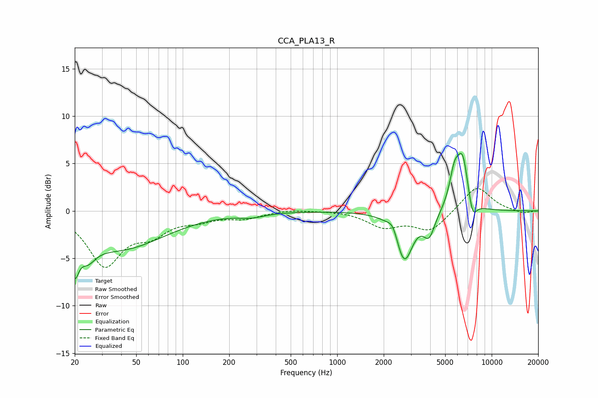

# CCA_PLA13_R
See [usage instructions](https://github.com/jaakkopasanen/AutoEq#usage) for more options and info.

### Parametric EQs
Apply preamp of -6.2 dB when using parametric equalizer.

|   # | Type    |   Fc (Hz) |    Q |   Gain (dB) |
|-----|---------|-----------|------|-------------|
|   1 | Peaking |        20 | 5.71 |        -3.5 |
|   2 | Peaking |        24 | 2.69 |        -2   |
|   3 | Peaking |        39 | 0.48 |        -3.9 |
|   4 | Peaking |       278 | 1.65 |        -0.4 |
|   5 | Peaking |      2298 | 4.37 |         1.1 |
|   6 | Peaking |      2716 | 2.62 |        -5.3 |
|   7 | Peaking |      3937 | 3.86 |        -2.3 |
|   8 | Peaking |      5739 | 4.17 |         3.4 |
|   9 | Peaking |      6489 | 3.7  |         5.2 |
|  10 | Peaking |      7518 | 5    |        -2.1 |

### Fixed Band EQs
When using fixed band (also called graphic) equalizer, apply preamp of **-2.5 dB** (if available) and set gains manually with these parameters.

|   # | Type    |   Fc (Hz) |    Q |   Gain (dB) |
|-----|---------|-----------|------|-------------|
|   1 | Peaking |        31 | 1.41 |        -5.6 |
|   2 | Peaking |        62 | 1.41 |        -2   |
|   3 | Peaking |       125 | 1.41 |        -0.8 |
|   4 | Peaking |       250 | 1.41 |        -0.7 |
|   5 | Peaking |       500 | 1.41 |         0.2 |
|   6 | Peaking |      1000 | 1.41 |         0.1 |
|   7 | Peaking |      2000 | 1.41 |        -1.6 |
|   8 | Peaking |      4000 | 1.41 |        -2.1 |
|   9 | Peaking |      8000 | 1.41 |         2.7 |
|  10 | Peaking |     16000 | 1.41 |        -0.3 |

### Graphs

