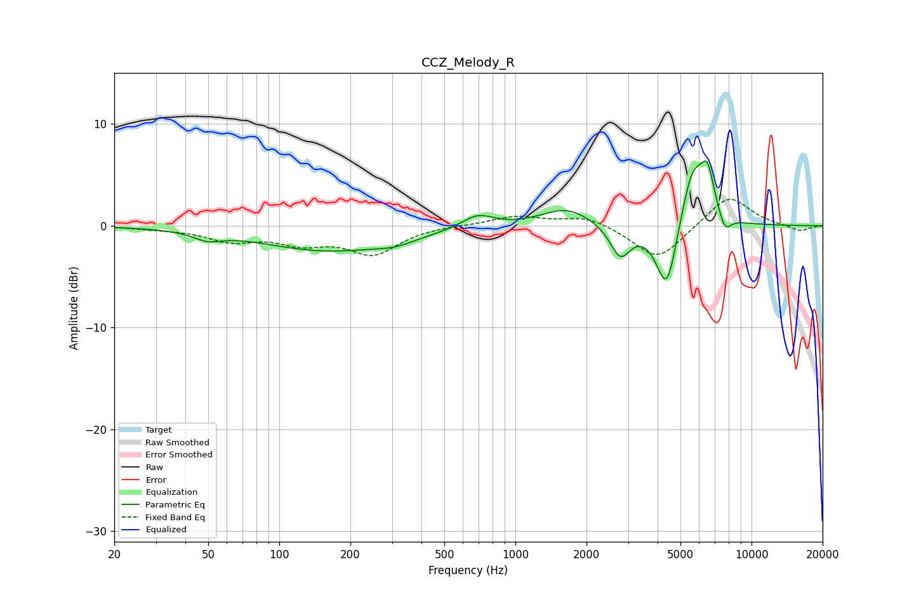

# CCZ_Melody_R
See [usage instructions](https://github.com/jaakkopasanen/AutoEq#usage) for more options and info.

### Parametric EQs
Apply preamp of -6.5 dB when using parametric equalizer.

|   # | Type    |   Fc (Hz) |    Q |   Gain (dB) |
|-----|---------|-----------|------|-------------|
|   1 | Peaking |        50 | 2.4  |        -0.8 |
|   2 | Peaking |       160 | 0.5  |        -2.4 |
|   3 | Peaking |       310 | 1.62 |        -0.6 |
|   4 | Peaking |       691 | 2.13 |         1.3 |
|   5 | Peaking |      1646 | 1.35 |         1.8 |
|   6 | Peaking |      2779 | 3.29 |        -3.1 |
|   7 | Peaking |      4380 | 3.08 |        -7.2 |
|   8 | Peaking |      5635 | 2.64 |         6.1 |
|   9 | Peaking |      6515 | 4.8  |         3.9 |
|  10 | Peaking |      7721 | 5.18 |        -1.7 |

### Fixed Band EQs
When using fixed band (also called graphic) equalizer, apply preamp of **-2.7 dB** (if available) and set gains manually with these parameters.

|   # | Type    |   Fc (Hz) |    Q |   Gain (dB) |
|-----|---------|-----------|------|-------------|
|   1 | Peaking |        31 | 1.41 |        -0.2 |
|   2 | Peaking |        62 | 1.41 |        -1.3 |
|   3 | Peaking |       125 | 1.41 |        -1.5 |
|   4 | Peaking |       250 | 1.41 |        -2.6 |
|   5 | Peaking |       500 | 1.41 |         0.1 |
|   6 | Peaking |      1000 | 1.41 |         0.9 |
|   7 | Peaking |      2000 | 1.41 |         1   |
|   8 | Peaking |      4000 | 1.41 |        -3.4 |
|   9 | Peaking |      8000 | 1.41 |         3.1 |
|  10 | Peaking |     16000 | 1.41 |        -0.6 |

### Graphs

