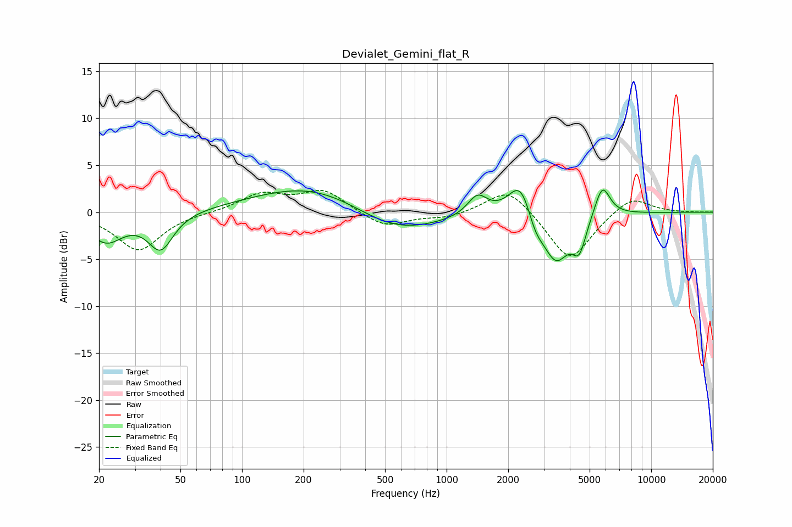

# Devialet_Gemini_flat_R
See [usage instructions](https://github.com/jaakkopasanen/AutoEq#usage) for more options and info.

### Parametric EQs
Apply preamp of -2.4 dB when using parametric equalizer.

|   # | Type    |   Fc (Hz) |    Q |   Gain (dB) |
|-----|---------|-----------|------|-------------|
|   1 | Peaking |        22 | 1.7  |        -3   |
|   2 | Peaking |        40 | 2.32 |        -3.9 |
|   3 | Peaking |       233 | 0.49 |         3.3 |
|   4 | Peaking |       546 | 0.65 |        -3   |
|   5 | Peaking |      1415 | 2.93 |         2.2 |
|   6 | Peaking |      2312 | 2.37 |         4.3 |
|   7 | Peaking |      2707 | 3.43 |        -2.1 |
|   8 | Peaking |      3420 | 2.19 |        -5.1 |
|   9 | Peaking |      4450 | 4.15 |        -3.2 |
|  10 | Peaking |      5768 | 3.65 |         3.4 |

### Fixed Band EQs
When using fixed band (also called graphic) equalizer, apply preamp of **-2.4 dB** (if available) and set gains manually with these parameters.

|   # | Type    |   Fc (Hz) |    Q |   Gain (dB) |
|-----|---------|-----------|------|-------------|
|   1 | Peaking |        31 | 1.41 |        -4.1 |
|   2 | Peaking |        62 | 1.41 |        -0   |
|   3 | Peaking |       125 | 1.41 |         1.9 |
|   4 | Peaking |       250 | 1.41 |         2.3 |
|   5 | Peaking |       500 | 1.41 |        -1.6 |
|   6 | Peaking |      1000 | 1.41 |        -0.6 |
|   7 | Peaking |      2000 | 1.41 |         2.8 |
|   8 | Peaking |      4000 | 1.41 |        -5.3 |
|   9 | Peaking |      8000 | 1.41 |         1.8 |
|  10 | Peaking |     16000 | 1.41 |        -0   |

### Graphs

