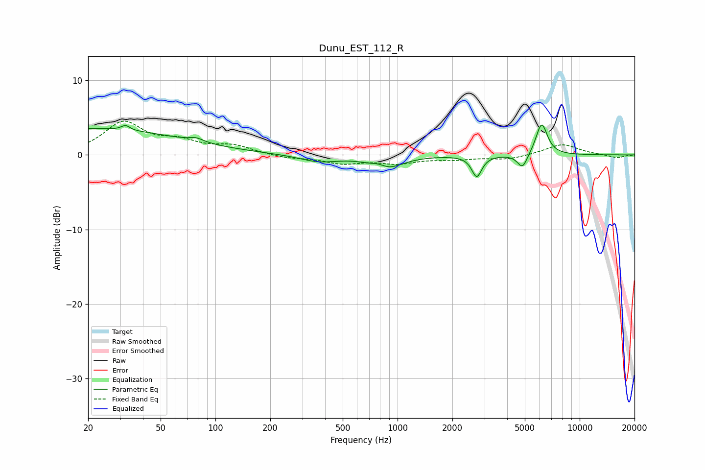

# Dunu_EST_112_R
See [usage instructions](https://github.com/jaakkopasanen/AutoEq#usage) for more options and info.

### Parametric EQs
Apply preamp of -4.1 dB when using parametric equalizer.

|   # | Type    |   Fc (Hz) |    Q |   Gain (dB) |
|-----|---------|-----------|------|-------------|
|   1 | Peaking |        20 | 0.26 |         3.5 |
|   2 | Peaking |        32 | 6    |         3.1 |
|   3 | Peaking |        32 | 5.93 |        -2.5 |
|   4 | Peaking |        78 | 3.71 |         0.5 |
|   5 | Peaking |       369 | 1.32 |        -0.9 |
|   6 | Peaking |       793 | 3.4  |         0.6 |
|   7 | Peaking |       859 | 1.65 |        -1.9 |
|   8 | Peaking |      2722 | 5.24 |        -2.8 |
|   9 | Peaking |      4856 | 5.01 |        -2   |
|  10 | Peaking |      6185 | 4.37 |         4.3 |

### Fixed Band EQs
When using fixed band (also called graphic) equalizer, apply preamp of **-4.6 dB** (if available) and set gains manually with these parameters.

|   # | Type    |   Fc (Hz) |    Q |   Gain (dB) |
|-----|---------|-----------|------|-------------|
|   1 | Peaking |        31 | 1.41 |         4.2 |
|   2 | Peaking |        62 | 1.41 |         1.5 |
|   3 | Peaking |       125 | 1.41 |         1.1 |
|   4 | Peaking |       250 | 1.41 |        -0.4 |
|   5 | Peaking |       500 | 1.41 |        -1   |
|   6 | Peaking |      1000 | 1.41 |        -1   |
|   7 | Peaking |      2000 | 1.41 |        -0.5 |
|   8 | Peaking |      4000 | 1.41 |        -0.6 |
|   9 | Peaking |      8000 | 1.41 |         1.5 |
|  10 | Peaking |     16000 | 1.41 |        -0.4 |

### Graphs

