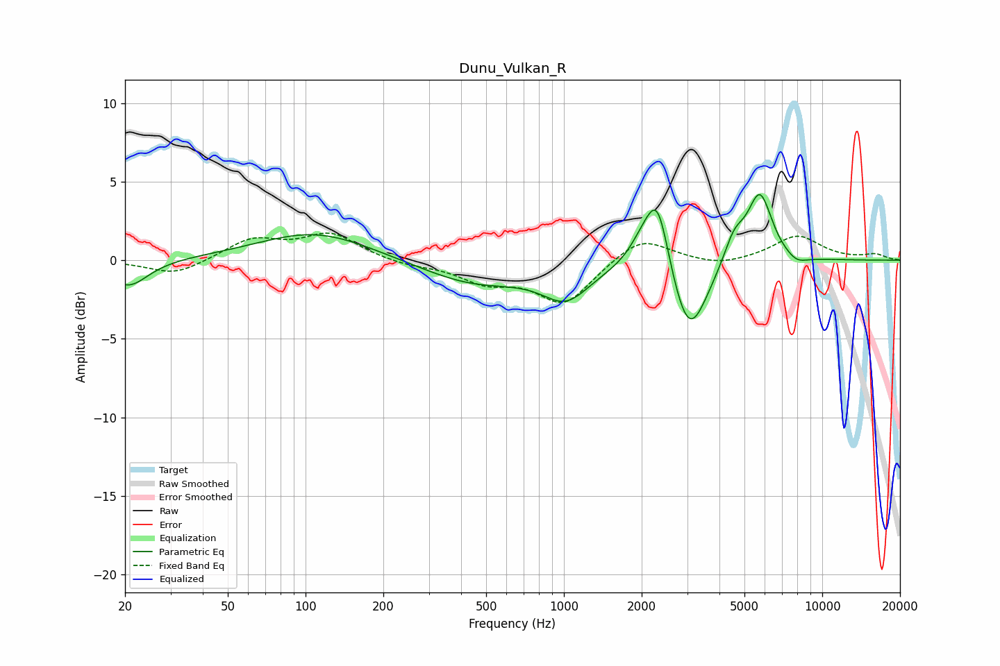

# Dunu_Vulkan_R
See [usage instructions](https://github.com/jaakkopasanen/AutoEq#usage) for more options and info.

### Parametric EQs
Apply preamp of -4.3 dB when using parametric equalizer.

|   # | Type    |   Fc (Hz) |    Q |   Gain (dB) |
|-----|---------|-----------|------|-------------|
|   1 | Peaking |        21 | 1.88 |        -1.7 |
|   2 | Peaking |       109 | 0.64 |         1.8 |
|   3 | Peaking |       451 | 0.68 |        -1.5 |
|   4 | Peaking |      1018 | 1.53 |        -2.1 |
|   5 | Peaking |      2039 | 2.48 |         1.6 |
|   6 | Peaking |      2313 | 3.2  |         4.3 |
|   7 | Peaking |      3052 | 2    |        -5.2 |
|   8 | Peaking |      4566 | 3.41 |         1.7 |
|   9 | Peaking |      5734 | 2.89 |         4.3 |
|  10 | Peaking |      7944 | 3.03 |        -0.5 |

### Fixed Band EQs
When using fixed band (also called graphic) equalizer, apply preamp of **-1.8 dB** (if available) and set gains manually with these parameters.

|   # | Type    |   Fc (Hz) |    Q |   Gain (dB) |
|-----|---------|-----------|------|-------------|
|   1 | Peaking |        31 | 1.41 |        -1   |
|   2 | Peaking |        62 | 1.41 |         1.3 |
|   3 | Peaking |       125 | 1.41 |         1.6 |
|   4 | Peaking |       250 | 1.41 |        -0.3 |
|   5 | Peaking |       500 | 1.41 |        -1.2 |
|   6 | Peaking |      1000 | 1.41 |        -2.7 |
|   7 | Peaking |      2000 | 1.41 |         1.6 |
|   8 | Peaking |      4000 | 1.41 |        -0.4 |
|   9 | Peaking |      8000 | 1.41 |         1.5 |
|  10 | Peaking |     16000 | 1.41 |         0.3 |

### Graphs

