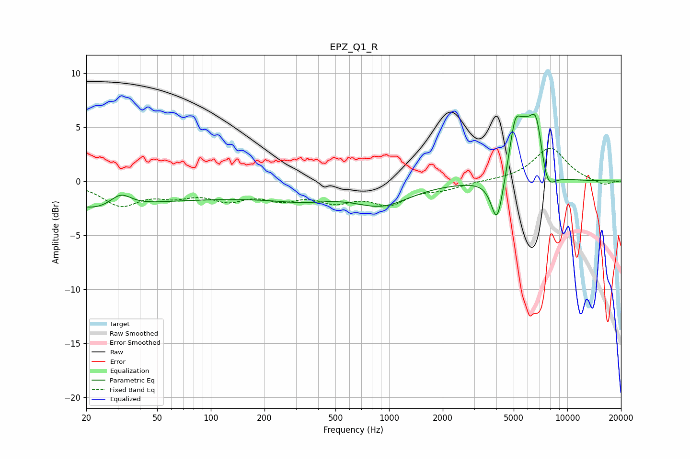

# EPZ_Q1_R
See [usage instructions](https://github.com/jaakkopasanen/AutoEq#usage) for more options and info.

### Parametric EQs
Apply preamp of -6.3 dB when using parametric equalizer.

|   # | Type    |   Fc (Hz) |    Q |   Gain (dB) |
|-----|---------|-----------|------|-------------|
|   1 | Peaking |        23 | 0.73 |        -1.5 |
|   2 | Peaking |        31 | 2.32 |         1.4 |
|   3 | Peaking |        62 | 0.18 |        -1.5 |
|   4 | Peaking |       335 | 0.84 |        -0.8 |
|   5 | Peaking |       912 | 0.89 |        -2   |
|   6 | Peaking |      4036 | 4.22 |        -4.3 |
|   7 | Peaking |      5093 | 4.25 |         4.4 |
|   8 | Peaking |      5754 | 3.57 |         2.4 |
|   9 | Peaking |      6691 | 3.21 |         6   |
|  10 | Peaking |      7632 | 3.15 |        -2.8 |

### Fixed Band EQs
When using fixed band (also called graphic) equalizer, apply preamp of **-3.1 dB** (if available) and set gains manually with these parameters.

|   # | Type    |   Fc (Hz) |    Q |   Gain (dB) |
|-----|---------|-----------|------|-------------|
|   1 | Peaking |        31 | 1.41 |        -2.1 |
|   2 | Peaking |        62 | 1.41 |        -1   |
|   3 | Peaking |       125 | 1.41 |        -1.4 |
|   4 | Peaking |       250 | 1.41 |        -1.3 |
|   5 | Peaking |       500 | 1.41 |        -1.5 |
|   6 | Peaking |      1000 | 1.41 |        -1.9 |
|   7 | Peaking |      2000 | 1.41 |        -0.6 |
|   8 | Peaking |      4000 | 1.41 |         0   |
|   9 | Peaking |      8000 | 1.41 |         3.1 |
|  10 | Peaking |     16000 | 1.41 |        -0.4 |

### Graphs

