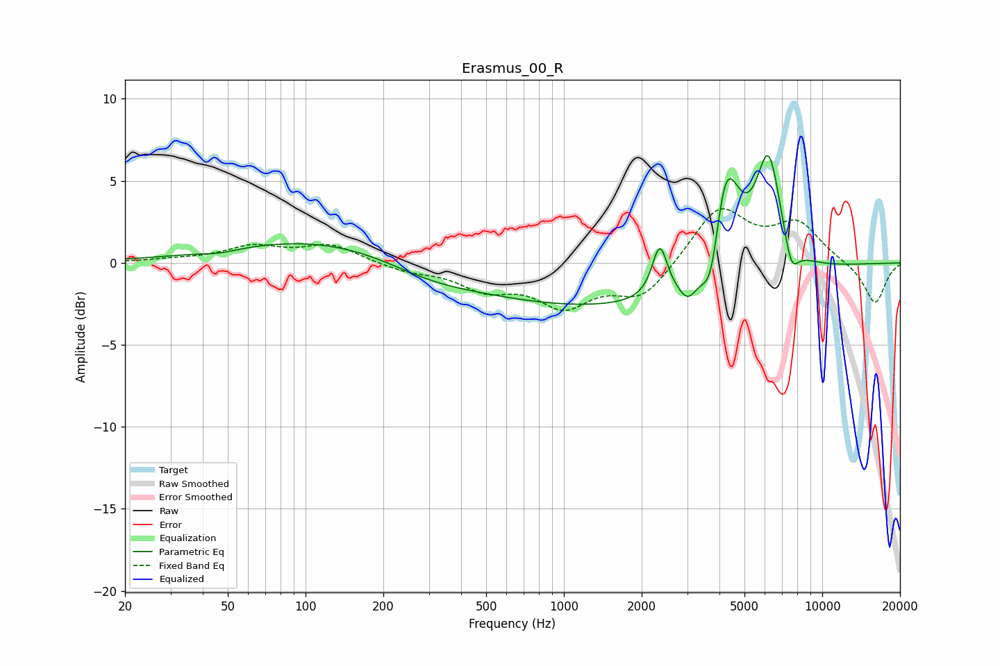

# Erasmus_00_R
See [usage instructions](https://github.com/jaakkopasanen/AutoEq#usage) for more options and info.

### Parametric EQs
Apply preamp of -6.6 dB when using parametric equalizer.

|   # | Type    |   Fc (Hz) |    Q |   Gain (dB) |
|-----|---------|-----------|------|-------------|
|   1 | Peaking |        47 | 2.01 |        -0.2 |
|   2 | Peaking |       137 | 0.34 |         1.7 |
|   3 | Peaking |       296 | 0.72 |        -1.1 |
|   4 | Peaking |      1506 | 0.24 |        -2.8 |
|   5 | Peaking |      2350 | 4.94 |         3.1 |
|   6 | Peaking |      3026 | 4.03 |        -1.3 |
|   7 | Peaking |      3724 | 3.72 |        -3.9 |
|   8 | Peaking |      4202 | 2.45 |         7.8 |
|   9 | Peaking |      6198 | 2.75 |         6.9 |
|  10 | Peaking |      7590 | 4.75 |        -1.9 |

### Fixed Band EQs
When using fixed band (also called graphic) equalizer, apply preamp of **-3.4 dB** (if available) and set gains manually with these parameters.

|   # | Type    |   Fc (Hz) |    Q |   Gain (dB) |
|-----|---------|-----------|------|-------------|
|   1 | Peaking |        31 | 1.41 |         0.1 |
|   2 | Peaking |        62 | 1.41 |         0.9 |
|   3 | Peaking |       125 | 1.41 |         1.1 |
|   4 | Peaking |       250 | 1.41 |        -0.5 |
|   5 | Peaking |       500 | 1.41 |        -1.4 |
|   6 | Peaking |      1000 | 1.41 |        -2.4 |
|   7 | Peaking |      2000 | 1.41 |        -2.1 |
|   8 | Peaking |      4000 | 1.41 |         3.4 |
|   9 | Peaking |      8000 | 1.41 |         2.3 |
|  10 | Peaking |     16000 | 1.41 |        -2.5 |

### Graphs

