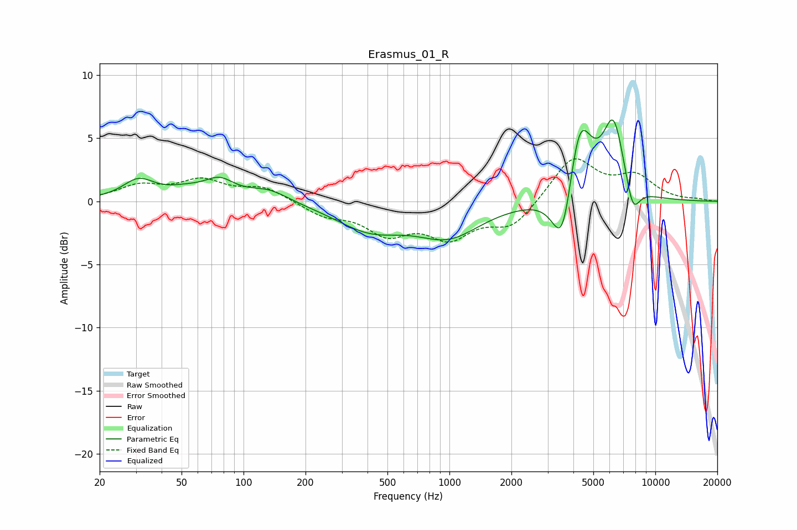

# Erasmus_01_R
See [usage instructions](https://github.com/jaakkopasanen/AutoEq#usage) for more options and info.

### Parametric EQs
Apply preamp of -6.5 dB when using parametric equalizer.

|   # | Type    |   Fc (Hz) |    Q |   Gain (dB) |
|-----|---------|-----------|------|-------------|
|   1 | Peaking |        31 | 1.86 |         1.5 |
|   2 | Peaking |        53 | 1.37 |         0.7 |
|   3 | Peaking |        77 | 1.97 |         1.3 |
|   4 | Peaking |       132 | 1.41 |         1   |
|   5 | Peaking |       411 | 0.85 |        -2.1 |
|   6 | Peaking |       992 | 0.91 |        -2.5 |
|   7 | Peaking |      3552 | 2.77 |        -5.6 |
|   8 | Peaking |      4275 | 2.32 |         7   |
|   9 | Peaking |      6272 | 2.62 |         5.9 |
|  10 | Peaking |      7766 | 3.84 |        -2.6 |

### Fixed Band EQs
When using fixed band (also called graphic) equalizer, apply preamp of **-3.5 dB** (if available) and set gains manually with these parameters.

|   # | Type    |   Fc (Hz) |    Q |   Gain (dB) |
|-----|---------|-----------|------|-------------|
|   1 | Peaking |        31 | 1.41 |         1.1 |
|   2 | Peaking |        62 | 1.41 |         1.5 |
|   3 | Peaking |       125 | 1.41 |         1.1 |
|   4 | Peaking |       250 | 1.41 |        -1   |
|   5 | Peaking |       500 | 1.41 |        -2.3 |
|   6 | Peaking |      1000 | 1.41 |        -2.6 |
|   7 | Peaking |      2000 | 1.41 |        -2   |
|   8 | Peaking |      4000 | 1.41 |         3.5 |
|   9 | Peaking |      8000 | 1.41 |         1.8 |
|  10 | Peaking |     16000 | 1.41 |         0.1 |

### Graphs

