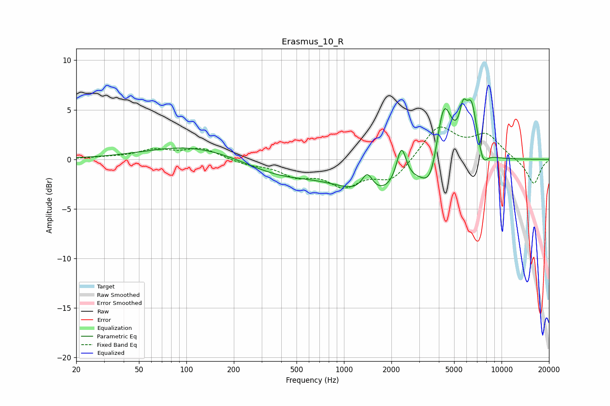

# Erasmus_10_R
See [usage instructions](https://github.com/jaakkopasanen/AutoEq#usage) for more options and info.

### Parametric EQs
Apply preamp of -6.2 dB when using parametric equalizer.

|   # | Type    |   Fc (Hz) |    Q |   Gain (dB) |
|-----|---------|-----------|------|-------------|
|   1 | Peaking |       110 | 0.49 |         1.4 |
|   2 | Peaking |       387 | 0.62 |        -1.5 |
|   3 | Peaking |      1406 | 3.98 |         1.9 |
|   4 | Peaking |      1621 | 0.61 |        -3.6 |
|   5 | Peaking |      2315 | 4.55 |         3.8 |
|   6 | Peaking |      3582 | 2.6  |        -3.3 |
|   7 | Peaking |      4283 | 2.69 |         7.1 |
|   8 | Peaking |      5696 | 5.95 |         2.9 |
|   9 | Peaking |      6449 | 3.76 |         5.1 |
|  10 | Peaking |      7619 | 4.81 |        -1.7 |

### Fixed Band EQs
When using fixed band (also called graphic) equalizer, apply preamp of **-3.4 dB** (if available) and set gains manually with these parameters.

|   # | Type    |   Fc (Hz) |    Q |   Gain (dB) |
|-----|---------|-----------|------|-------------|
|   1 | Peaking |        31 | 1.41 |         0.1 |
|   2 | Peaking |        62 | 1.41 |         0.9 |
|   3 | Peaking |       125 | 1.41 |         1.1 |
|   4 | Peaking |       250 | 1.41 |        -0.5 |
|   5 | Peaking |       500 | 1.41 |        -1.4 |
|   6 | Peaking |      1000 | 1.41 |        -2.4 |
|   7 | Peaking |      2000 | 1.41 |        -2.1 |
|   8 | Peaking |      4000 | 1.41 |         3.4 |
|   9 | Peaking |      8000 | 1.41 |         2.3 |
|  10 | Peaking |     16000 | 1.41 |        -2.6 |

### Graphs

