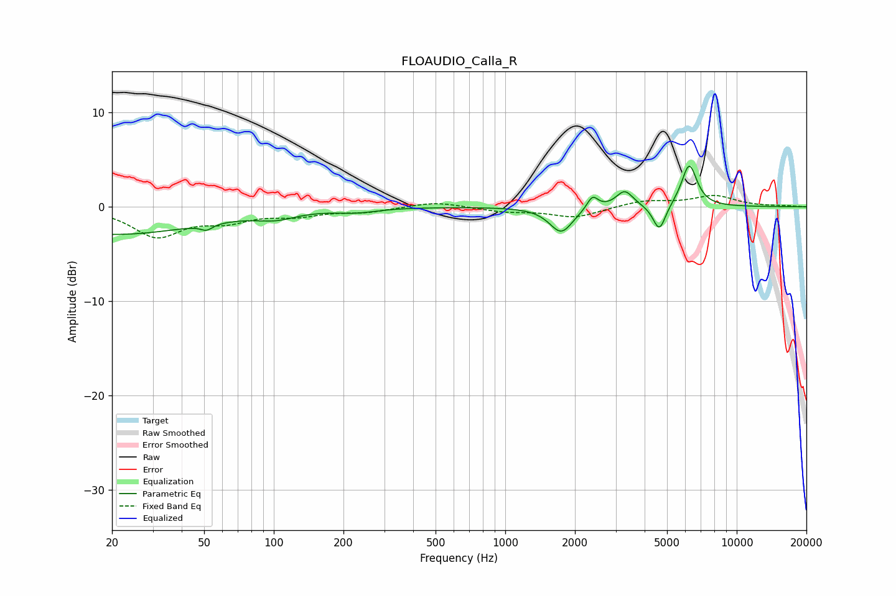

# FLOAUDIO_Calla_R
See [usage instructions](https://github.com/jaakkopasanen/AutoEq#usage) for more options and info.

### Parametric EQs
Apply preamp of -4.4 dB when using parametric equalizer.

|   # | Type    |   Fc (Hz) |    Q |   Gain (dB) |
|-----|---------|-----------|------|-------------|
|   1 | Peaking |        20 | 0.37 |        -2.9 |
|   2 | Peaking |        51 | 5.87 |        -2.5 |
|   3 | Peaking |        51 | 6    |         1.8 |
|   4 | Peaking |       103 | 1.68 |        -0.7 |
|   5 | Peaking |       227 | 1.62 |        -0.4 |
|   6 | Peaking |      1745 | 2.83 |        -2.7 |
|   7 | Peaking |      2380 | 6    |         1.4 |
|   8 | Peaking |      3283 | 3.87 |         1.8 |
|   9 | Peaking |      4631 | 5.13 |        -2.8 |
|  10 | Peaking |      6235 | 4.13 |         4.5 |

### Fixed Band EQs
When using fixed band (also called graphic) equalizer, apply preamp of **-1.3 dB** (if available) and set gains manually with these parameters.

|   # | Type    |   Fc (Hz) |    Q |   Gain (dB) |
|-----|---------|-----------|------|-------------|
|   1 | Peaking |        31 | 1.41 |        -3   |
|   2 | Peaking |        62 | 1.41 |        -1.3 |
|   3 | Peaking |       125 | 1.41 |        -0.8 |
|   4 | Peaking |       250 | 1.41 |        -0.5 |
|   5 | Peaking |       500 | 1.41 |         0.6 |
|   6 | Peaking |      1000 | 1.41 |        -0.5 |
|   7 | Peaking |      2000 | 1.41 |        -1.1 |
|   8 | Peaking |      4000 | 1.41 |         0.6 |
|   9 | Peaking |      8000 | 1.41 |         1.1 |
|  10 | Peaking |     16000 | 1.41 |         0.1 |

### Graphs

