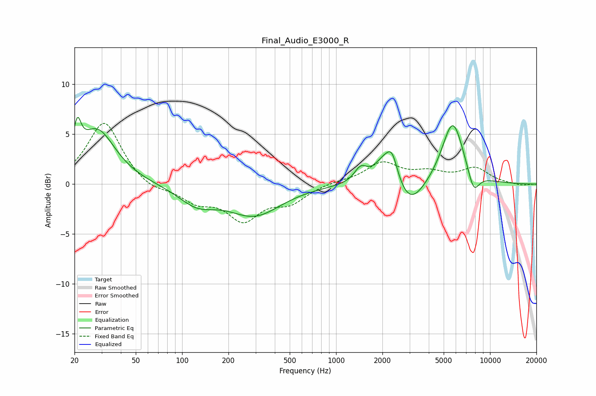

# Final_Audio_E3000_R
See [usage instructions](https://github.com/jaakkopasanen/AutoEq#usage) for more options and info.

### Parametric EQs
Apply preamp of -6.8 dB when using parametric equalizer.

|   # | Type    |   Fc (Hz) |    Q |   Gain (dB) |
|-----|---------|-----------|------|-------------|
|   1 | Peaking |        21 | 5.87 |         3.2 |
|   2 | Peaking |        28 | 1.2  |         5.4 |
|   3 | Peaking |       125 | 1.18 |        -1.8 |
|   4 | Peaking |       296 | 0.82 |        -3   |
|   5 | Peaking |      1442 | 3.5  |         1.3 |
|   6 | Peaking |      2113 | 1.96 |         3.1 |
|   7 | Peaking |      2319 | 4.31 |         1.8 |
|   8 | Peaking |      2992 | 1.46 |        -3   |
|   9 | Peaking |      5724 | 1.91 |         6.5 |
|  10 | Peaking |      7811 | 3.51 |        -2.3 |

### Fixed Band EQs
When using fixed band (also called graphic) equalizer, apply preamp of **-6.2 dB** (if available) and set gains manually with these parameters.

|   # | Type    |   Fc (Hz) |    Q |   Gain (dB) |
|-----|---------|-----------|------|-------------|
|   1 | Peaking |        31 | 1.41 |         6.3 |
|   2 | Peaking |        62 | 1.41 |        -0.8 |
|   3 | Peaking |       125 | 1.41 |        -1.6 |
|   4 | Peaking |       250 | 1.41 |        -3.3 |
|   5 | Peaking |       500 | 1.41 |        -1.6 |
|   6 | Peaking |      1000 | 1.41 |         0.2 |
|   7 | Peaking |      2000 | 1.41 |         2.1 |
|   8 | Peaking |      4000 | 1.41 |         1   |
|   9 | Peaking |      8000 | 1.41 |         1.5 |
|  10 | Peaking |     16000 | 1.41 |        -0.2 |

### Graphs

