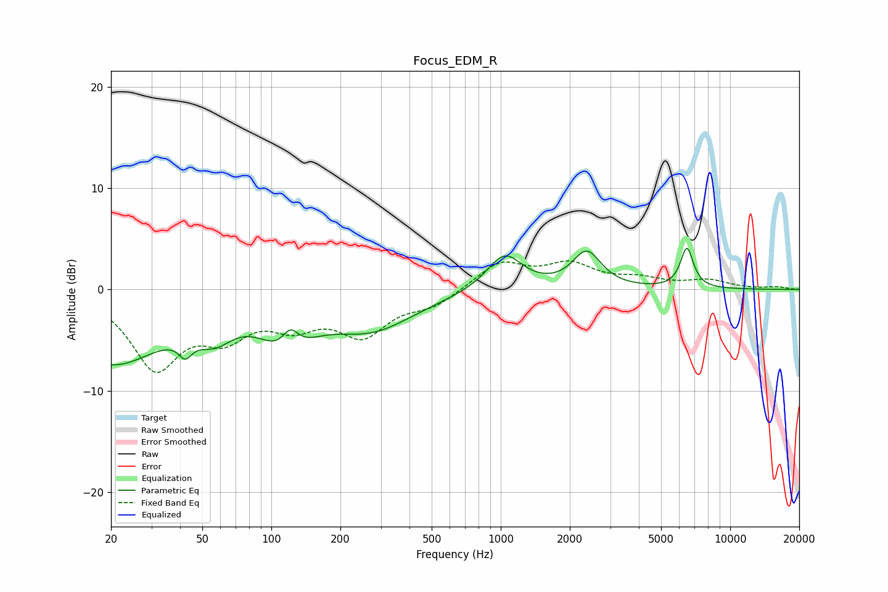

# Focus_EDM_R
See [usage instructions](https://github.com/jaakkopasanen/AutoEq#usage) for more options and info.

### Parametric EQs
Apply preamp of -4.2 dB when using parametric equalizer.

|   # | Type    |   Fc (Hz) |    Q |   Gain (dB) |
|-----|---------|-----------|------|-------------|
|   1 | Peaking |        20 | 0.62 |        -7.2 |
|   2 | Peaking |        42 | 5.18 |        -5.1 |
|   3 | Peaking |        42 | 5.38 |         3.4 |
|   4 | Peaking |        57 | 1.8  |        -2.3 |
|   5 | Peaking |       116 | 1.32 |        -4.4 |
|   6 | Peaking |       121 | 3.72 |         2.4 |
|   7 | Peaking |       274 | 0.74 |        -3.7 |
|   8 | Peaking |      1039 | 1.82 |         3.6 |
|   9 | Peaking |      2372 | 2.29 |         3.6 |
|  10 | Peaking |      6479 | 4.89 |         4   |

### Fixed Band EQs
When using fixed band (also called graphic) equalizer, apply preamp of **-2.9 dB** (if available) and set gains manually with these parameters.

|   # | Type    |   Fc (Hz) |    Q |   Gain (dB) |
|-----|---------|-----------|------|-------------|
|   1 | Peaking |        31 | 1.41 |        -7.4 |
|   2 | Peaking |        62 | 1.41 |        -3.7 |
|   3 | Peaking |       125 | 1.41 |        -2.8 |
|   4 | Peaking |       250 | 1.41 |        -4.1 |
|   5 | Peaking |       500 | 1.41 |        -1.4 |
|   6 | Peaking |      1000 | 1.41 |         2.6 |
|   7 | Peaking |      2000 | 1.41 |         2.3 |
|   8 | Peaking |      4000 | 1.41 |         0.9 |
|   9 | Peaking |      8000 | 1.41 |         0.8 |
|  10 | Peaking |     16000 | 1.41 |         0.2 |

### Graphs

