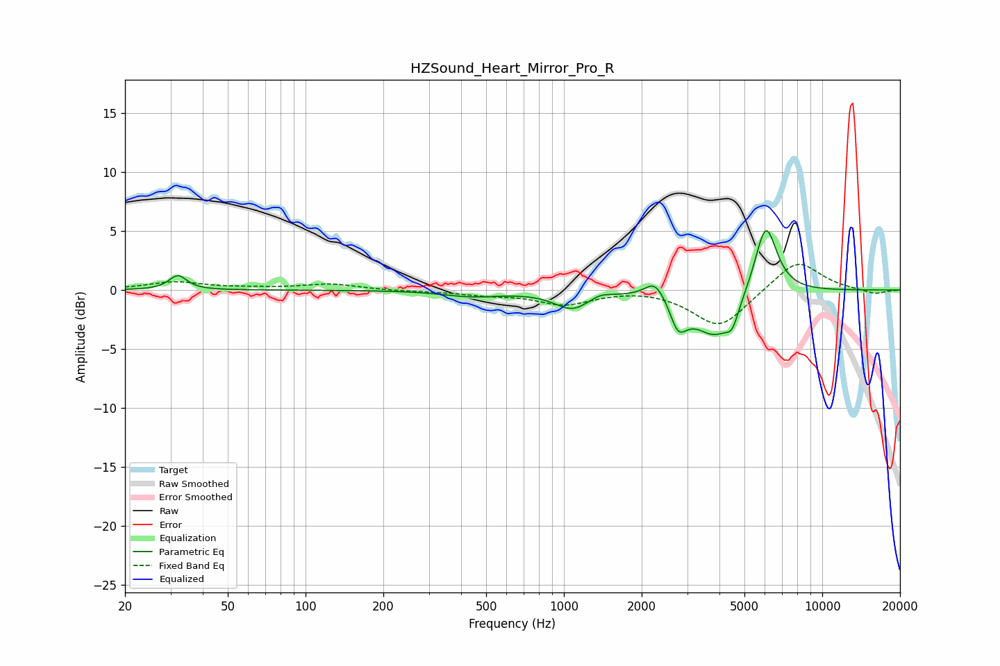

# HZSound_Heart_Mirror_Pro_R
See [usage instructions](https://github.com/jaakkopasanen/AutoEq#usage) for more options and info.

### Parametric EQs
Apply preamp of -5.1 dB when using parametric equalizer.

|   # | Type    |   Fc (Hz) |    Q |   Gain (dB) |
|-----|---------|-----------|------|-------------|
|   1 | Peaking |        32 | 4.28 |         1.2 |
|   2 | Peaking |       440 | 1.26 |        -0.5 |
|   3 | Peaking |      1081 | 2.05 |        -1.5 |
|   4 | Peaking |      1376 | 3.23 |         0.4 |
|   5 | Peaking |      2256 | 3.55 |         1.6 |
|   6 | Peaking |      2760 | 4.82 |        -2   |
|   7 | Peaking |      2951 | 3.28 |        -0.5 |
|   8 | Peaking |      3865 | 1.69 |        -3.9 |
|   9 | Peaking |      4484 | 5.98 |        -1.4 |
|  10 | Peaking |      6044 | 3.14 |         6.1 |

### Fixed Band EQs
When using fixed band (also called graphic) equalizer, apply preamp of **-2.3 dB** (if available) and set gains manually with these parameters.

|   # | Type    |   Fc (Hz) |    Q |   Gain (dB) |
|-----|---------|-----------|------|-------------|
|   1 | Peaking |        31 | 1.41 |         0.7 |
|   2 | Peaking |        62 | 1.41 |         0.1 |
|   3 | Peaking |       125 | 1.41 |         0.5 |
|   4 | Peaking |       250 | 1.41 |        -0.1 |
|   5 | Peaking |       500 | 1.41 |        -0.3 |
|   6 | Peaking |      1000 | 1.41 |        -1.2 |
|   7 | Peaking |      2000 | 1.41 |         0.2 |
|   8 | Peaking |      4000 | 1.41 |        -3.2 |
|   9 | Peaking |      8000 | 1.41 |         2.6 |
|  10 | Peaking |     16000 | 1.41 |        -0.4 |

### Graphs

