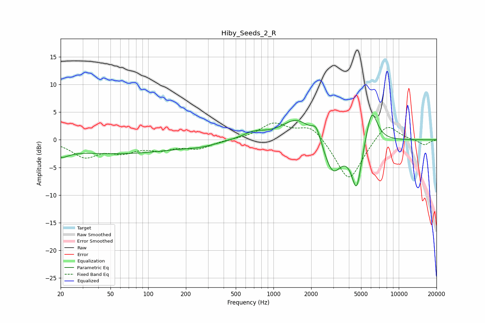

# Hiby_Seeds_2_R
See [usage instructions](https://github.com/jaakkopasanen/AutoEq#usage) for more options and info.

### Parametric EQs
Apply preamp of -4.5 dB when using parametric equalizer.

|   # | Type    |   Fc (Hz) |    Q |   Gain (dB) |
|-----|---------|-----------|------|-------------|
|   1 | Peaking |        20 | 2.47 |        -3   |
|   2 | Peaking |        20 | 2.85 |         1.4 |
|   3 | Peaking |        57 | 0.3  |        -2.5 |
|   4 | Peaking |       261 | 1.13 |        -0.6 |
|   5 | Peaking |       698 | 1.55 |         1.2 |
|   6 | Peaking |      1543 | 1.19 |         3.9 |
|   7 | Peaking |      2197 | 3.96 |         2.6 |
|   8 | Peaking |      2965 | 1.95 |        -6.3 |
|   9 | Peaking |      4609 | 3.4  |        -8.8 |
|  10 | Peaking |      6074 | 2.97 |         6.5 |

### Fixed Band EQs
When using fixed band (also called graphic) equalizer, apply preamp of **-3.1 dB** (if available) and set gains manually with these parameters.

|   # | Type    |   Fc (Hz) |    Q |   Gain (dB) |
|-----|---------|-----------|------|-------------|
|   1 | Peaking |        31 | 1.41 |        -2.9 |
|   2 | Peaking |        62 | 1.41 |        -1.9 |
|   3 | Peaking |       125 | 1.41 |        -1.4 |
|   4 | Peaking |       250 | 1.41 |        -1.5 |
|   5 | Peaking |       500 | 1.41 |         0.1 |
|   6 | Peaking |      1000 | 1.41 |         2.8 |
|   7 | Peaking |      2000 | 1.41 |         2.7 |
|   8 | Peaking |      4000 | 1.41 |        -7.7 |
|   9 | Peaking |      8000 | 1.41 |         3.3 |
|  10 | Peaking |     16000 | 1.41 |        -1   |

### Graphs

