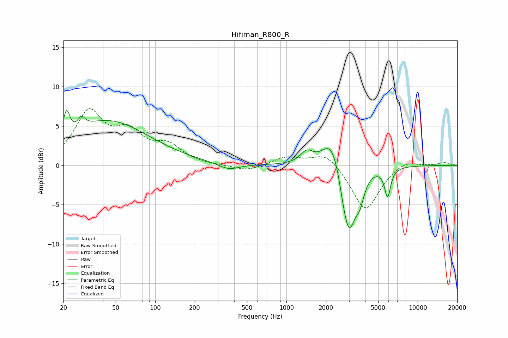

# Hifiman_R800_R
See [usage instructions](https://github.com/jaakkopasanen/AutoEq#usage) for more options and info.

### Parametric EQs
Apply preamp of -7.1 dB when using parametric equalizer.

|   # | Type    |   Fc (Hz) |    Q |   Gain (dB) |
|-----|---------|-----------|------|-------------|
|   1 | Peaking |        21 | 6    |         3.1 |
|   2 | Peaking |        27 | 5.73 |         1.2 |
|   3 | Peaking |        43 | 0.44 |         5.6 |
|   4 | Peaking |       364 | 1.75 |        -0.8 |
|   5 | Peaking |      1426 | 3.02 |         1.4 |
|   6 | Peaking |      2235 | 1.91 |         4.1 |
|   7 | Peaking |      2707 | 3.89 |        -1.5 |
|   8 | Peaking |      3002 | 2.76 |        -8.1 |
|   9 | Peaking |      3625 | 4.15 |        -2.5 |
|  10 | Peaking |      5900 | 6    |        -3.6 |

### Fixed Band EQs
When using fixed band (also called graphic) equalizer, apply preamp of **-7.3 dB** (if available) and set gains manually with these parameters.

|   # | Type    |   Fc (Hz) |    Q |   Gain (dB) |
|-----|---------|-----------|------|-------------|
|   1 | Peaking |        31 | 1.41 |         6.4 |
|   2 | Peaking |        62 | 1.41 |         3.5 |
|   3 | Peaking |       125 | 1.41 |         2.2 |
|   4 | Peaking |       250 | 1.41 |        -0   |
|   5 | Peaking |       500 | 1.41 |        -0.8 |
|   6 | Peaking |      1000 | 1.41 |         1   |
|   7 | Peaking |      2000 | 1.41 |         1.8 |
|   8 | Peaking |      4000 | 1.41 |        -5.9 |
|   9 | Peaking |      8000 | 1.41 |         0.9 |
|  10 | Peaking |     16000 | 1.41 |         0.4 |

### Graphs

