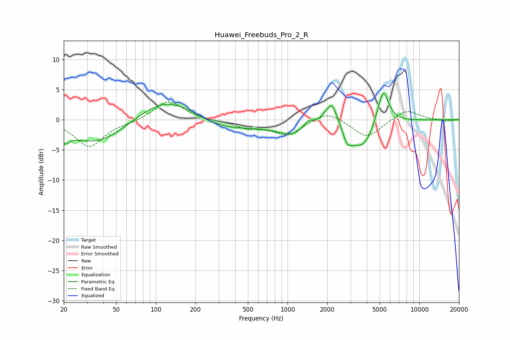

# Huawei_Freebuds_Pro_2_R
See [usage instructions](https://github.com/jaakkopasanen/AutoEq#usage) for more options and info.

### Parametric EQs
Apply preamp of -4.4 dB when using parametric equalizer.

|   # | Type    |   Fc (Hz) |    Q |   Gain (dB) |
|-----|---------|-----------|------|-------------|
|   1 | Peaking |        20 | 4.55 |        -1.6 |
|   2 | Peaking |        36 | 0.61 |        -4.2 |
|   3 | Peaking |       122 | 0.61 |         4.3 |
|   4 | Peaking |       310 | 0.59 |        -2.1 |
|   5 | Peaking |      1118 | 1.08 |        -2.3 |
|   6 | Peaking |      1437 | 3.22 |         1.5 |
|   7 | Peaking |      2158 | 2.77 |         4.3 |
|   8 | Peaking |      2835 | 3.57 |        -2.7 |
|   9 | Peaking |      3720 | 1.6  |        -4.6 |
|  10 | Peaking |      5298 | 3.11 |         6.2 |

### Fixed Band EQs
When using fixed band (also called graphic) equalizer, apply preamp of **-3.1 dB** (if available) and set gains manually with these parameters.

|   # | Type    |   Fc (Hz) |    Q |   Gain (dB) |
|-----|---------|-----------|------|-------------|
|   1 | Peaking |        31 | 1.41 |        -4.5 |
|   2 | Peaking |        62 | 1.41 |        -0.4 |
|   3 | Peaking |       125 | 1.41 |         3.3 |
|   4 | Peaking |       250 | 1.41 |        -0.1 |
|   5 | Peaking |       500 | 1.41 |        -1.2 |
|   6 | Peaking |      1000 | 1.41 |        -2.5 |
|   7 | Peaking |      2000 | 1.41 |         1.6 |
|   8 | Peaking |      4000 | 1.41 |        -3   |
|   9 | Peaking |      8000 | 1.41 |         1.8 |
|  10 | Peaking |     16000 | 1.41 |        -0.3 |

### Graphs

