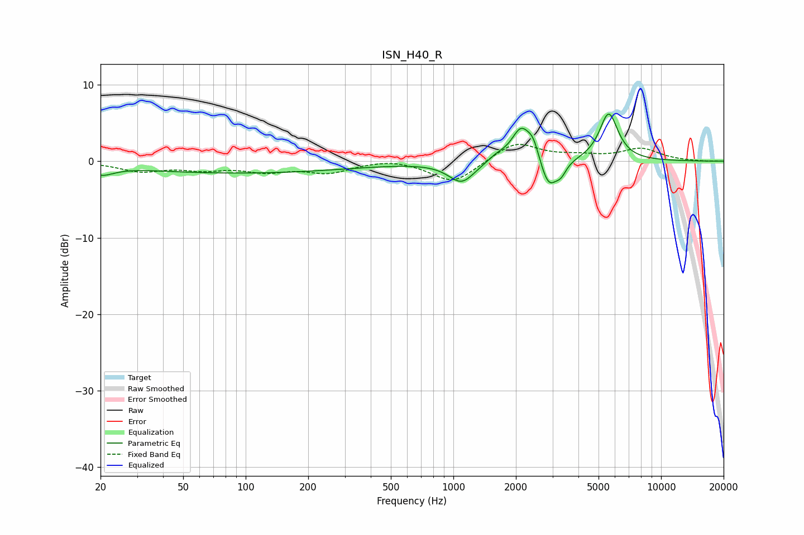

# ISN_H40_R
See [usage instructions](https://github.com/jaakkopasanen/AutoEq#usage) for more options and info.

### Parametric EQs
Apply preamp of -6.2 dB when using parametric equalizer.

|   # | Type    |   Fc (Hz) |    Q |   Gain (dB) |
|-----|---------|-----------|------|-------------|
|   1 | Peaking |        20 | 2.43 |        -1.1 |
|   2 | Peaking |        33 | 0.83 |         0.1 |
|   3 | Peaking |        88 | 0.24 |        -1.6 |
|   4 | Peaking |      1097 | 2.23 |        -2.8 |
|   5 | Peaking |      1624 | 2.98 |         0.8 |
|   6 | Peaking |      2116 | 3.1  |         4.3 |
|   7 | Peaking |      2425 | 4.99 |         2.1 |
|   8 | Peaking |      2876 | 3.47 |        -3.9 |
|   9 | Peaking |      3301 | 5.68 |        -1.3 |
|  10 | Peaking |      5595 | 3.1  |         6.3 |

### Fixed Band EQs
When using fixed band (also called graphic) equalizer, apply preamp of **-2.3 dB** (if available) and set gains manually with these parameters.

|   # | Type    |   Fc (Hz) |    Q |   Gain (dB) |
|-----|---------|-----------|------|-------------|
|   1 | Peaking |        31 | 1.41 |        -1.2 |
|   2 | Peaking |        62 | 1.41 |        -0.9 |
|   3 | Peaking |       125 | 1.41 |        -1.2 |
|   4 | Peaking |       250 | 1.41 |        -1.4 |
|   5 | Peaking |       500 | 1.41 |         0.4 |
|   6 | Peaking |      1000 | 1.41 |        -2.9 |
|   7 | Peaking |      2000 | 1.41 |         2.5 |
|   8 | Peaking |      4000 | 1.41 |         0.5 |
|   9 | Peaking |      8000 | 1.41 |         1.6 |
|  10 | Peaking |     16000 | 1.41 |        -0   |

### Graphs

