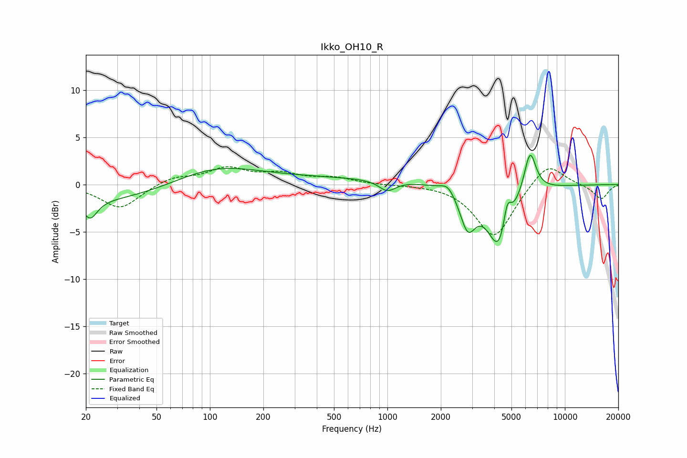

# Ikko_OH10_R
See [usage instructions](https://github.com/jaakkopasanen/AutoEq#usage) for more options and info.

### Parametric EQs
Apply preamp of -3.2 dB when using parametric equalizer.

|   # | Type    |   Fc (Hz) |    Q |   Gain (dB) |
|-----|---------|-----------|------|-------------|
|   1 | Peaking |        21 | 3.62 |        -2   |
|   2 | Peaking |        26 | 0.33 |        -1.9 |
|   3 | Peaking |       103 | 0.6  |         1.7 |
|   4 | Peaking |       330 | 0.18 |         0.7 |
|   5 | Peaking |       999 | 3    |        -1.1 |
|   6 | Peaking |      2193 | 3.56 |         1   |
|   7 | Peaking |      2836 | 3.19 |        -3.9 |
|   8 | Peaking |      4293 | 2.08 |        -6.9 |
|   9 | Peaking |      4731 | 6    |         3.2 |
|  10 | Peaking |      6361 | 3.99 |         4.6 |

### Fixed Band EQs
When using fixed band (also called graphic) equalizer, apply preamp of **-2.0 dB** (if available) and set gains manually with these parameters.

|   # | Type    |   Fc (Hz) |    Q |   Gain (dB) |
|-----|---------|-----------|------|-------------|
|   1 | Peaking |        31 | 1.41 |        -2.6 |
|   2 | Peaking |        62 | 1.41 |         0.8 |
|   3 | Peaking |       125 | 1.41 |         1.6 |
|   4 | Peaking |       250 | 1.41 |         1   |
|   5 | Peaking |       500 | 1.41 |         0.6 |
|   6 | Peaking |      1000 | 1.41 |        -0   |
|   7 | Peaking |      2000 | 1.41 |         0.1 |
|   8 | Peaking |      4000 | 1.41 |        -5.7 |
|   9 | Peaking |      8000 | 1.41 |         2.5 |
|  10 | Peaking |     16000 | 1.41 |        -1.6 |

### Graphs

