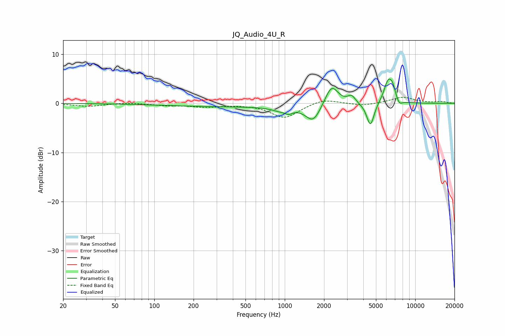

# JQ_Audio_4U_R
See [usage instructions](https://github.com/jaakkopasanen/AutoEq#usage) for more options and info.

### Parametric EQs
Apply preamp of -5.0 dB when using parametric equalizer.

|   # | Type    |   Fc (Hz) |    Q |   Gain (dB) |
|-----|---------|-----------|------|-------------|
|   1 | Peaking |       536 | 0.18 |        -0.7 |
|   2 | Peaking |       938 | 2.11 |        -0.8 |
|   3 | Peaking |      1075 | 5.65 |        -0.7 |
|   4 | Peaking |      1652 | 2.47 |        -3.5 |
|   5 | Peaking |      2286 | 2.74 |         4.3 |
|   6 | Peaking |      3250 | 4.62 |         1.5 |
|   7 | Peaking |      4535 | 4.95 |        -4.8 |
|   8 | Peaking |      6207 | 4.04 |         4.5 |
|   9 | Peaking |      6724 | 6    |         1.9 |
|  10 | Peaking |      7529 | 5.76 |        -1.2 |

### Fixed Band EQs
When using fixed band (also called graphic) equalizer, apply preamp of **-1.3 dB** (if available) and set gains manually with these parameters.

|   # | Type    |   Fc (Hz) |    Q |   Gain (dB) |
|-----|---------|-----------|------|-------------|
|   1 | Peaking |        31 | 1.41 |        -0.6 |
|   2 | Peaking |        62 | 1.41 |         0.2 |
|   3 | Peaking |       125 | 1.41 |        -0.4 |
|   4 | Peaking |       250 | 1.41 |        -0.7 |
|   5 | Peaking |       500 | 1.41 |        -0.1 |
|   6 | Peaking |      1000 | 1.41 |        -2.9 |
|   7 | Peaking |      2000 | 1.41 |         1   |
|   8 | Peaking |      4000 | 1.41 |        -0.5 |
|   9 | Peaking |      8000 | 1.41 |         1.3 |
|  10 | Peaking |     16000 | 1.41 |         0.3 |

### Graphs

