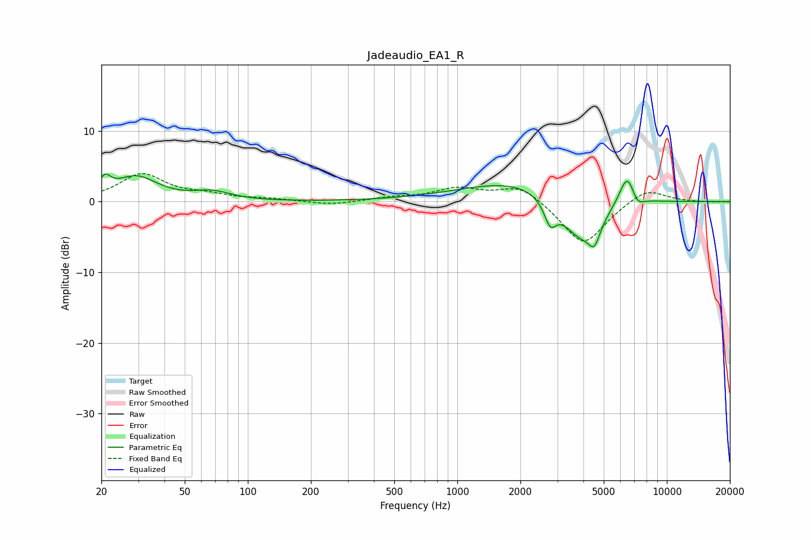

# Jadeaudio_EA1_R
See [usage instructions](https://github.com/jaakkopasanen/AutoEq#usage) for more options and info.

### Parametric EQs
Apply preamp of -4.0 dB when using parametric equalizer.

|   # | Type    |   Fc (Hz) |    Q |   Gain (dB) |
|-----|---------|-----------|------|-------------|
|   1 | Peaking |        21 | 5.29 |         2.1 |
|   2 | Peaking |        29 | 1.39 |         3.4 |
|   3 | Peaking |        68 | 1.63 |         1.2 |
|   4 | Peaking |      2170 | 0.5  |         3.5 |
|   5 | Peaking |      2776 | 4.98 |        -3.2 |
|   6 | Peaking |      3882 | 1.36 |        -6.9 |
|   7 | Peaking |      4513 | 5.14 |        -2.9 |
|   8 | Peaking |      6476 | 3.52 |         4.6 |
|   9 | Peaking |      7101 | 4.43 |         0.7 |
|  10 | Peaking |      7177 | 4.49 |        -2.3 |

### Fixed Band EQs
When using fixed band (also called graphic) equalizer, apply preamp of **-4.1 dB** (if available) and set gains manually with these parameters.

|   # | Type    |   Fc (Hz) |    Q |   Gain (dB) |
|-----|---------|-----------|------|-------------|
|   1 | Peaking |        31 | 1.41 |         3.8 |
|   2 | Peaking |        62 | 1.41 |         0.8 |
|   3 | Peaking |       125 | 1.41 |         0.3 |
|   4 | Peaking |       250 | 1.41 |        -0.5 |
|   5 | Peaking |       500 | 1.41 |         0.5 |
|   6 | Peaking |      1000 | 1.41 |         1.7 |
|   7 | Peaking |      2000 | 1.41 |         2.4 |
|   8 | Peaking |      4000 | 1.41 |        -6.3 |
|   9 | Peaking |      8000 | 1.41 |         2.1 |
|  10 | Peaking |     16000 | 1.41 |        -0.1 |

### Graphs

