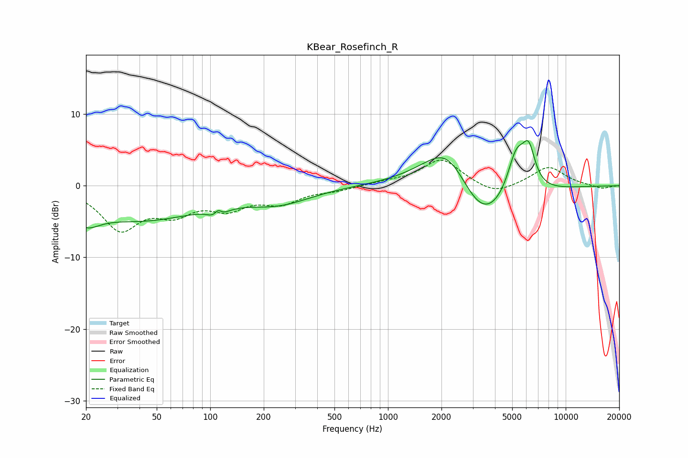

# KBear_Rosefinch_R
See [usage instructions](https://github.com/jaakkopasanen/AutoEq#usage) for more options and info.

### Parametric EQs
Apply preamp of -6.4 dB when using parametric equalizer.

|   # | Type    |   Fc (Hz) |    Q |   Gain (dB) |
|-----|---------|-----------|------|-------------|
|   1 | Peaking |        20 | 5.99 |        -0.3 |
|   2 | Peaking |        20 | 1.86 |        -2.3 |
|   3 | Peaking |        41 | 0.4  |        -4.6 |
|   4 | Peaking |       110 | 4.2  |        -3.8 |
|   5 | Peaking |       111 | 5.58 |         3.4 |
|   6 | Peaking |       244 | 0.77 |        -2.1 |
|   7 | Peaking |      2194 | 0.94 |         8.4 |
|   8 | Peaking |      3339 | 0.86 |        -8.2 |
|   9 | Peaking |      5265 | 2.69 |         6.1 |
|  10 | Peaking |      6195 | 3.75 |         5.1 |

### Fixed Band EQs
When using fixed band (also called graphic) equalizer, apply preamp of **-3.7 dB** (if available) and set gains manually with these parameters.

|   # | Type    |   Fc (Hz) |    Q |   Gain (dB) |
|-----|---------|-----------|------|-------------|
|   1 | Peaking |        31 | 1.41 |        -5.8 |
|   2 | Peaking |        62 | 1.41 |        -3.1 |
|   3 | Peaking |       125 | 1.41 |        -2.7 |
|   4 | Peaking |       250 | 1.41 |        -2.1 |
|   5 | Peaking |       500 | 1.41 |        -0.6 |
|   6 | Peaking |      1000 | 1.41 |         0.4 |
|   7 | Peaking |      2000 | 1.41 |         3.7 |
|   8 | Peaking |      4000 | 1.41 |        -1.4 |
|   9 | Peaking |      8000 | 1.41 |         2.6 |
|  10 | Peaking |     16000 | 1.41 |        -0.5 |

### Graphs

