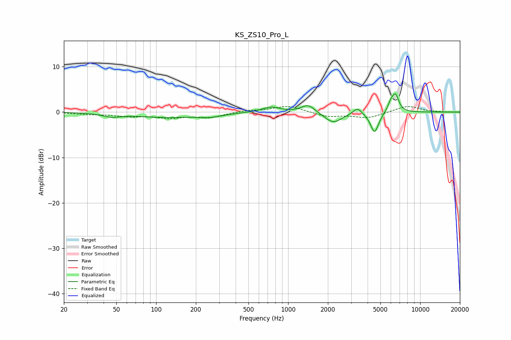

# KS_ZS10_Pro_L
See [usage instructions](https://github.com/jaakkopasanen/AutoEq#usage) for more options and info.

### Parametric EQs
Apply preamp of -4.1 dB when using parametric equalizer.

|   # | Type    |   Fc (Hz) |    Q |   Gain (dB) |
|-----|---------|-----------|------|-------------|
|   1 | Peaking |        46 | 2.18 |        -0.7 |
|   2 | Peaking |       118 | 0.59 |        -1.1 |
|   3 | Peaking |       257 | 1.56 |        -0.7 |
|   4 | Peaking |       739 | 2.17 |         1.2 |
|   5 | Peaking |      1416 | 2.75 |         1.8 |
|   6 | Peaking |      2196 | 2.16 |        -2.4 |
|   7 | Peaking |      3350 | 4.42 |         1.5 |
|   8 | Peaking |      4516 | 4.51 |        -4.6 |
|   9 | Peaking |      5994 | 5.93 |         1.7 |
|  10 | Peaking |      6510 | 5.4  |         3.6 |

### Fixed Band EQs
When using fixed band (also called graphic) equalizer, apply preamp of **-1.3 dB** (if available) and set gains manually with these parameters.

|   # | Type    |   Fc (Hz) |    Q |   Gain (dB) |
|-----|---------|-----------|------|-------------|
|   1 | Peaking |        31 | 1.41 |        -0.4 |
|   2 | Peaking |        62 | 1.41 |        -0.8 |
|   3 | Peaking |       125 | 1.41 |        -1.1 |
|   4 | Peaking |       250 | 1.41 |        -1.1 |
|   5 | Peaking |       500 | 1.41 |         0.4 |
|   6 | Peaking |      1000 | 1.41 |         1.4 |
|   7 | Peaking |      2000 | 1.41 |        -1   |
|   8 | Peaking |      4000 | 1.41 |        -1.3 |
|   9 | Peaking |      8000 | 1.41 |         1.4 |
|  10 | Peaking |     16000 | 1.41 |        -0   |

### Graphs

