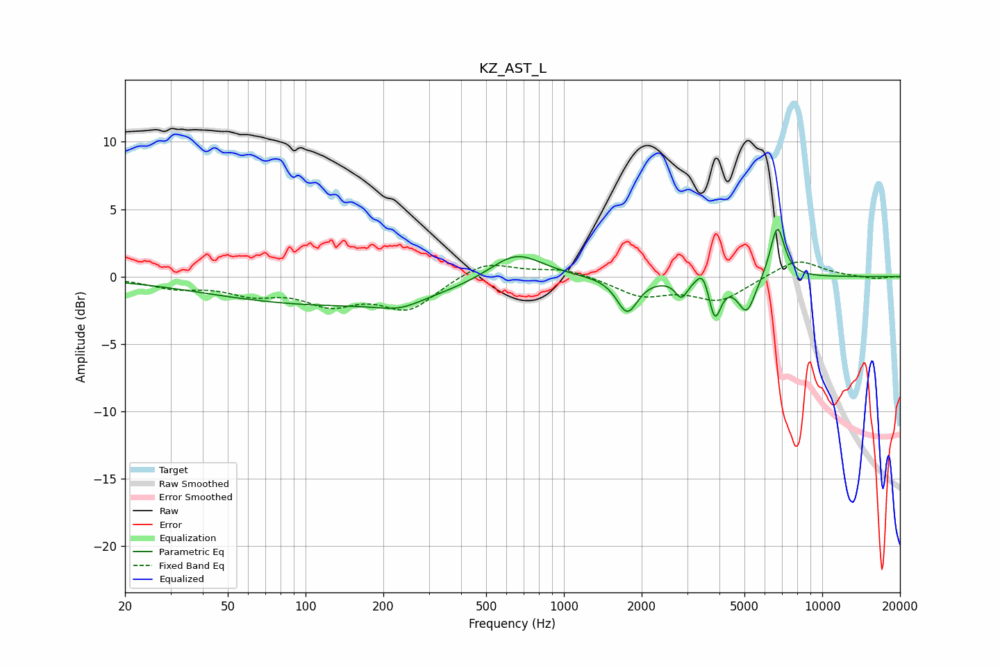

# KZ_AST_L
See [usage instructions](https://github.com/jaakkopasanen/AutoEq#usage) for more options and info.

### Parametric EQs
Apply preamp of -3.6 dB when using parametric equalizer.

|   # | Type    |   Fc (Hz) |    Q |   Gain (dB) |
|-----|---------|-----------|------|-------------|
|   1 | Peaking |        46 | 2.61 |        -0   |
|   2 | Peaking |       124 | 0.31 |        -2.1 |
|   3 | Peaking |       231 | 1.62 |        -0.7 |
|   4 | Peaking |       652 | 1.35 |         2.2 |
|   5 | Peaking |      1759 | 3.51 |        -2.6 |
|   6 | Peaking |      2852 | 6    |        -1.3 |
|   7 | Peaking |      3451 | 5.98 |         1.2 |
|   8 | Peaking |      3840 | 6    |        -3   |
|   9 | Peaking |      5100 | 4    |        -2.7 |
|  10 | Peaking |      6701 | 4.86 |         3.9 |

### Fixed Band EQs
When using fixed band (also called graphic) equalizer, apply preamp of **-1.2 dB** (if available) and set gains manually with these parameters.

|   # | Type    |   Fc (Hz) |    Q |   Gain (dB) |
|-----|---------|-----------|------|-------------|
|   1 | Peaking |        31 | 1.41 |        -0.7 |
|   2 | Peaking |        62 | 1.41 |        -1.1 |
|   3 | Peaking |       125 | 1.41 |        -1.8 |
|   4 | Peaking |       250 | 1.41 |        -2.3 |
|   5 | Peaking |       500 | 1.41 |         1.2 |
|   6 | Peaking |      1000 | 1.41 |         0.6 |
|   7 | Peaking |      2000 | 1.41 |        -1.4 |
|   8 | Peaking |      4000 | 1.41 |        -1.7 |
|   9 | Peaking |      8000 | 1.41 |         1.4 |
|  10 | Peaking |     16000 | 1.41 |        -0.2 |

### Graphs

