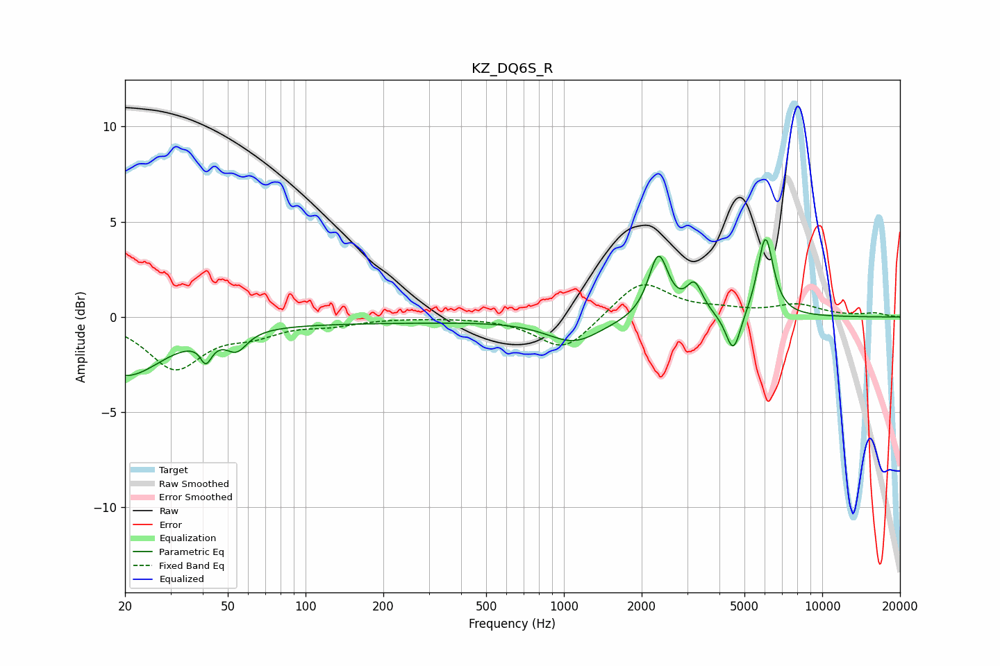

# KZ_DQ6S_R
See [usage instructions](https://github.com/jaakkopasanen/AutoEq#usage) for more options and info.

### Parametric EQs
Apply preamp of -4.2 dB when using parametric equalizer.

|   # | Type    |   Fc (Hz) |    Q |   Gain (dB) |
|-----|---------|-----------|------|-------------|
|   1 | Peaking |        20 | 0.97 |        -2.9 |
|   2 | Peaking |        40 | 5.95 |         0.6 |
|   3 | Peaking |        41 | 5.81 |        -1.7 |
|   4 | Peaking |        54 | 3.54 |        -1   |
|   5 | Peaking |       121 | 0.2  |        -0.3 |
|   6 | Peaking |      1097 | 1.34 |        -1.3 |
|   7 | Peaking |      2322 | 3.76 |         3.3 |
|   8 | Peaking |      3204 | 4.53 |         1.5 |
|   9 | Peaking |      4527 | 4.81 |        -2.2 |
|  10 | Peaking |      6027 | 4.54 |         4.2 |

### Fixed Band EQs
When using fixed band (also called graphic) equalizer, apply preamp of **-1.8 dB** (if available) and set gains manually with these parameters.

|   # | Type    |   Fc (Hz) |    Q |   Gain (dB) |
|-----|---------|-----------|------|-------------|
|   1 | Peaking |        31 | 1.41 |        -2.6 |
|   2 | Peaking |        62 | 1.41 |        -0.7 |
|   3 | Peaking |       125 | 1.41 |        -0.3 |
|   4 | Peaking |       250 | 1.41 |        -0   |
|   5 | Peaking |       500 | 1.41 |         0   |
|   6 | Peaking |      1000 | 1.41 |        -1.8 |
|   7 | Peaking |      2000 | 1.41 |         1.9 |
|   8 | Peaking |      4000 | 1.41 |         0.3 |
|   9 | Peaking |      8000 | 1.41 |         0.6 |
|  10 | Peaking |     16000 | 1.41 |         0.2 |

### Graphs

