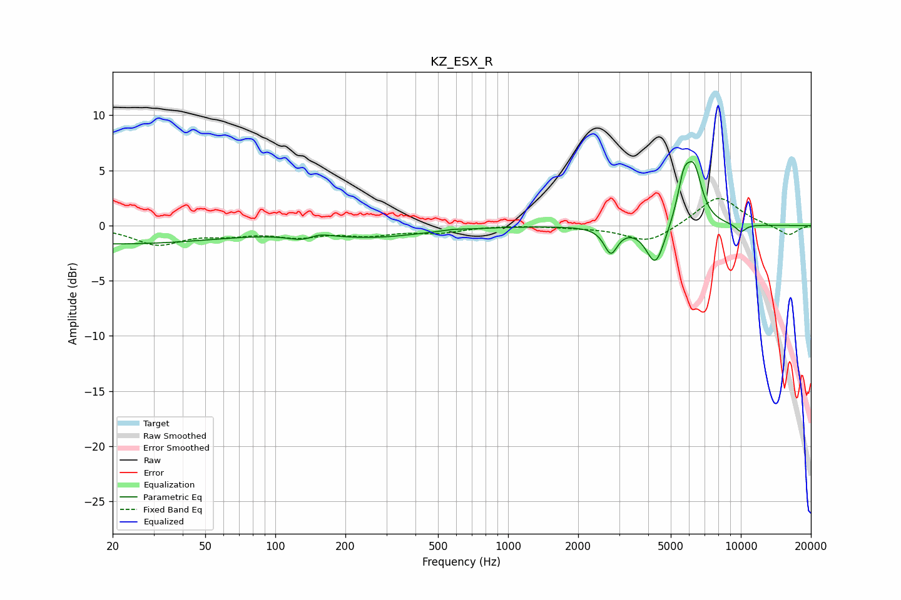

# KZ_ESX_R
See [usage instructions](https://github.com/jaakkopasanen/AutoEq#usage) for more options and info.

### Parametric EQs
Apply preamp of -5.9 dB when using parametric equalizer.

|   # | Type    |   Fc (Hz) |    Q |   Gain (dB) |
|-----|---------|-----------|------|-------------|
|   1 | Peaking |        20 | 0.28 |        -1.6 |
|   2 | Peaking |       140 | 2.06 |        -1.3 |
|   3 | Peaking |       150 | 2.5  |         1.1 |
|   4 | Peaking |       272 | 0.67 |        -0.9 |
|   5 | Peaking |       581 | 4.21 |         0.1 |
|   6 | Peaking |      2763 | 4.94 |        -2.3 |
|   7 | Peaking |      4299 | 3.52 |        -3.7 |
|   8 | Peaking |      5685 | 5.01 |         3.4 |
|   9 | Peaking |      6306 | 3.98 |         4.6 |
|  10 | Peaking |     10000 | 5.37 |        -0.7 |

### Fixed Band EQs
When using fixed band (also called graphic) equalizer, apply preamp of **-2.6 dB** (if available) and set gains manually with these parameters.

|   # | Type    |   Fc (Hz) |    Q |   Gain (dB) |
|-----|---------|-----------|------|-------------|
|   1 | Peaking |        31 | 1.41 |        -1.6 |
|   2 | Peaking |        62 | 1.41 |        -0.6 |
|   3 | Peaking |       125 | 1.41 |        -0.9 |
|   4 | Peaking |       250 | 1.41 |        -0.7 |
|   5 | Peaking |       500 | 1.41 |        -0.6 |
|   6 | Peaking |      1000 | 1.41 |         0.1 |
|   7 | Peaking |      2000 | 1.41 |        -0.1 |
|   8 | Peaking |      4000 | 1.41 |        -1.6 |
|   9 | Peaking |      8000 | 1.41 |         2.7 |
|  10 | Peaking |     16000 | 1.41 |        -0.9 |

### Graphs

