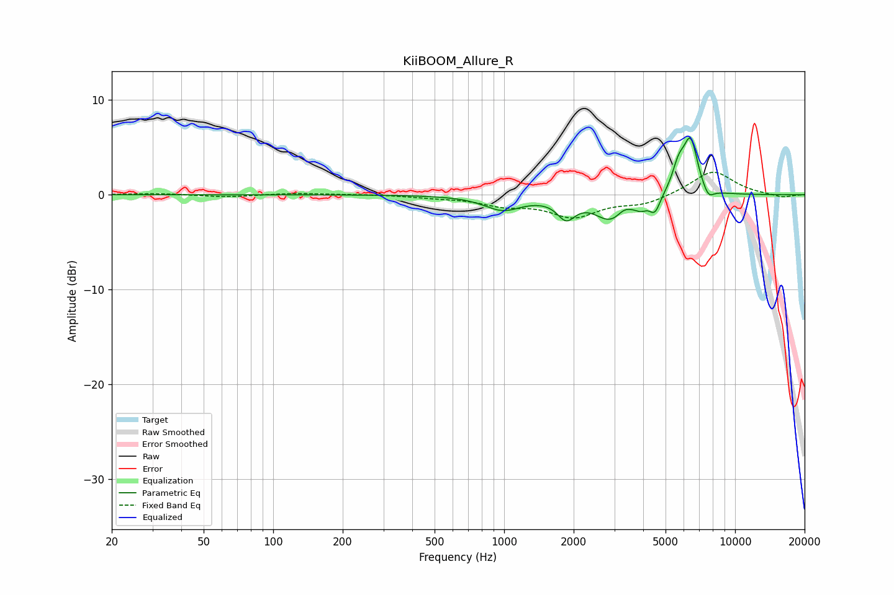

# KiiBOOM_Allure_R
See [usage instructions](https://github.com/jaakkopasanen/AutoEq#usage) for more options and info.

### Parametric EQs
Apply preamp of -6.1 dB when using parametric equalizer.

|   # | Type    |   Fc (Hz) |    Q |   Gain (dB) |
|-----|---------|-----------|------|-------------|
|   1 | Peaking |       986 | 1.75 |        -1.5 |
|   2 | Peaking |      1858 | 3.67 |        -2   |
|   3 | Peaking |      2876 | 2.12 |        -2.4 |
|   4 | Peaking |      3288 | 5.92 |         0.4 |
|   5 | Peaking |      3915 | 4.98 |        -0.8 |
|   6 | Peaking |      4496 | 6    |        -1.7 |
|   7 | Peaking |      5700 | 4.84 |         2.6 |
|   8 | Peaking |      6390 | 4.7  |         3.7 |
|   9 | Peaking |      6501 | 4.33 |         1.8 |
|  10 | Peaking |      7665 | 5.65 |        -1.1 |

### Fixed Band EQs
When using fixed band (also called graphic) equalizer, apply preamp of **-2.5 dB** (if available) and set gains manually with these parameters.

|   # | Type    |   Fc (Hz) |    Q |   Gain (dB) |
|-----|---------|-----------|------|-------------|
|   1 | Peaking |        31 | 1.41 |         0.1 |
|   2 | Peaking |        62 | 1.41 |        -0.2 |
|   3 | Peaking |       125 | 1.41 |         0.2 |
|   4 | Peaking |       250 | 1.41 |         0.1 |
|   5 | Peaking |       500 | 1.41 |        -0.2 |
|   6 | Peaking |      1000 | 1.41 |        -0.9 |
|   7 | Peaking |      2000 | 1.41 |        -2.2 |
|   8 | Peaking |      4000 | 1.41 |        -0.9 |
|   9 | Peaking |      8000 | 1.41 |         2.6 |
|  10 | Peaking |     16000 | 1.41 |        -0.3 |

### Graphs

