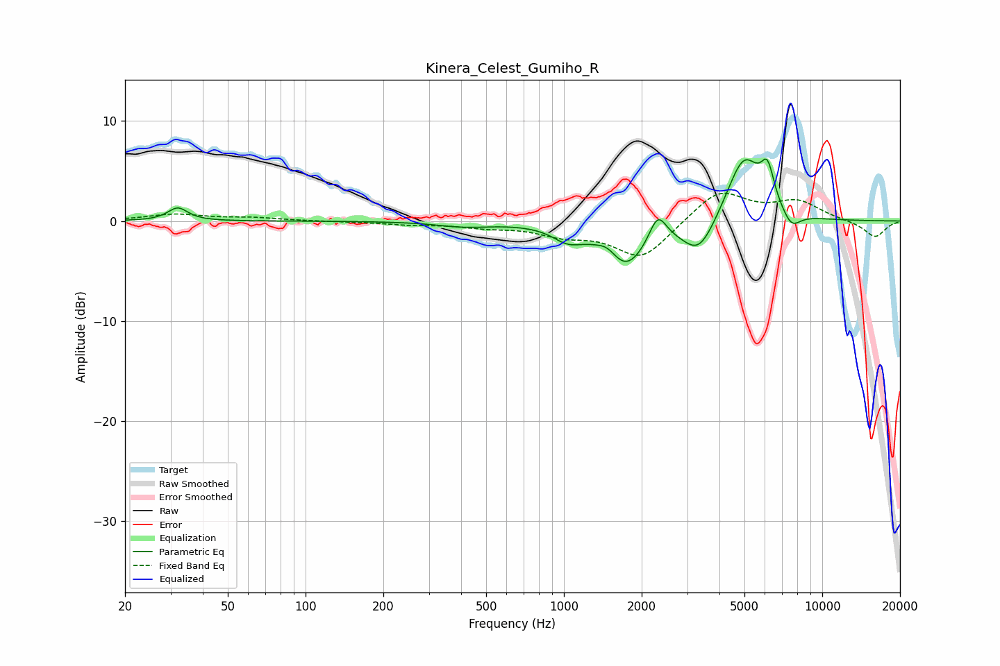

# Kinera_Celest_Gumiho_R
See [usage instructions](https://github.com/jaakkopasanen/AutoEq#usage) for more options and info.

### Parametric EQs
Apply preamp of -6.3 dB when using parametric equalizer.

|   # | Type    |   Fc (Hz) |    Q |   Gain (dB) |
|-----|---------|-----------|------|-------------|
|   1 | Peaking |        32 | 3.76 |         1.3 |
|   2 | Peaking |       411 | 1.39 |        -0.5 |
|   3 | Peaking |      1034 | 2.45 |        -1.3 |
|   4 | Peaking |      1482 | 3.46 |         1.1 |
|   5 | Peaking |      1721 | 1.65 |        -4.7 |
|   6 | Peaking |      2308 | 4.22 |         2.8 |
|   7 | Peaking |      3336 | 2.2  |        -3.5 |
|   8 | Peaking |      4972 | 2.06 |         6.6 |
|   9 | Peaking |      6144 | 5.42 |         3.5 |
|  10 | Peaking |      7597 | 3.85 |        -1.6 |

### Fixed Band EQs
When using fixed band (also called graphic) equalizer, apply preamp of **-2.9 dB** (if available) and set gains manually with these parameters.

|   # | Type    |   Fc (Hz) |    Q |   Gain (dB) |
|-----|---------|-----------|------|-------------|
|   1 | Peaking |        31 | 1.41 |         0.6 |
|   2 | Peaking |        62 | 1.41 |         0.3 |
|   3 | Peaking |       125 | 1.41 |        -0   |
|   4 | Peaking |       250 | 1.41 |        -0.3 |
|   5 | Peaking |       500 | 1.41 |        -0.5 |
|   6 | Peaking |      1000 | 1.41 |        -1.2 |
|   7 | Peaking |      2000 | 1.41 |        -3.7 |
|   8 | Peaking |      4000 | 1.41 |         3.2 |
|   9 | Peaking |      8000 | 1.41 |         1.9 |
|  10 | Peaking |     16000 | 1.41 |        -1.6 |

### Graphs

