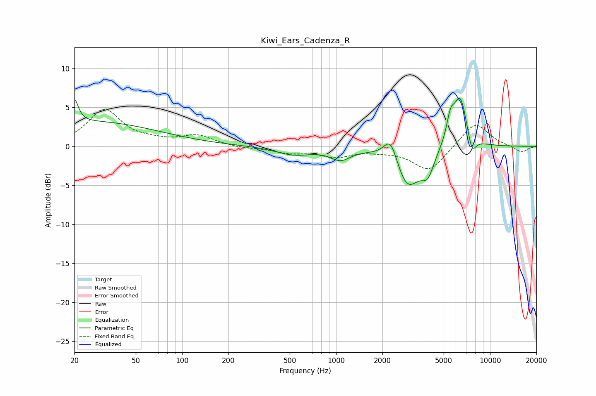

# Kiwi_Ears_Cadenza_R
See [usage instructions](https://github.com/jaakkopasanen/AutoEq#usage) for more options and info.

### Parametric EQs
Apply preamp of -6.3 dB when using parametric equalizer.

|   # | Type    |   Fc (Hz) |    Q |   Gain (dB) |
|-----|---------|-----------|------|-------------|
|   1 | Peaking |        20 | 5.9  |         3   |
|   2 | Peaking |        26 | 0.33 |         3.1 |
|   3 | Peaking |       532 | 1.23 |        -1   |
|   4 | Peaking |      1066 | 2.14 |        -1.4 |
|   5 | Peaking |      2264 | 3.17 |         3.2 |
|   6 | Peaking |      2906 | 1.74 |        -5.3 |
|   7 | Peaking |      3939 | 3.41 |        -2.7 |
|   8 | Peaking |      5529 | 5.53 |         2.6 |
|   9 | Peaking |      6398 | 2.92 |         6.6 |
|  10 | Peaking |      7614 | 4.82 |        -2.6 |

### Fixed Band EQs
When using fixed band (also called graphic) equalizer, apply preamp of **-4.9 dB** (if available) and set gains manually with these parameters.

|   # | Type    |   Fc (Hz) |    Q |   Gain (dB) |
|-----|---------|-----------|------|-------------|
|   1 | Peaking |        31 | 1.41 |         4.6 |
|   2 | Peaking |        62 | 1.41 |         0.4 |
|   3 | Peaking |       125 | 1.41 |         1.3 |
|   4 | Peaking |       250 | 1.41 |        -0.2 |
|   5 | Peaking |       500 | 1.41 |        -0.7 |
|   6 | Peaking |      1000 | 1.41 |        -1.2 |
|   7 | Peaking |      2000 | 1.41 |        -0.4 |
|   8 | Peaking |      4000 | 1.41 |        -3.2 |
|   9 | Peaking |      8000 | 1.41 |         3.2 |
|  10 | Peaking |     16000 | 1.41 |        -0.8 |

### Graphs

