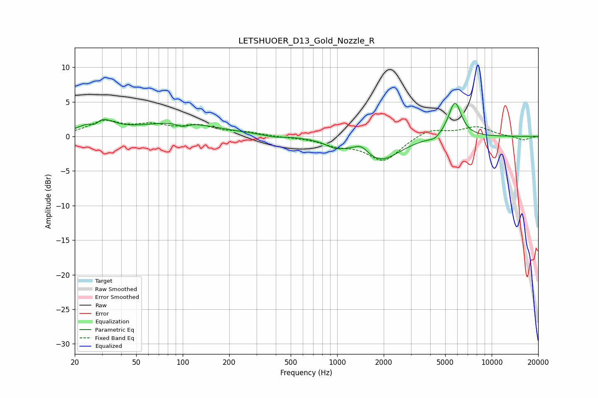

# LETSHUOER_D13_Gold_Nozzle_R
See [usage instructions](https://github.com/jaakkopasanen/AutoEq#usage) for more options and info.

### Parametric EQs
Apply preamp of -4.9 dB when using parametric equalizer.

|   # | Type    |   Fc (Hz) |    Q |   Gain (dB) |
|-----|---------|-----------|------|-------------|
|   1 | Peaking |        27 | 4.49 |        -1.2 |
|   2 | Peaking |        28 | 1.74 |         2.6 |
|   3 | Peaking |        94 | 0.56 |         1.9 |
|   4 | Peaking |       100 | 4.19 |        -0.6 |
|   5 | Peaking |       387 | 2.52 |        -0.3 |
|   6 | Peaking |       980 | 2.09 |        -1   |
|   7 | Peaking |      1439 | 3.27 |         1.1 |
|   8 | Peaking |      1900 | 1.14 |        -3.4 |
|   9 | Peaking |      4276 | 4.35 |        -0.5 |
|  10 | Peaking |      5780 | 3.28 |         5.2 |

### Fixed Band EQs
When using fixed band (also called graphic) equalizer, apply preamp of **-2.4 dB** (if available) and set gains manually with these parameters.

|   # | Type    |   Fc (Hz) |    Q |   Gain (dB) |
|-----|---------|-----------|------|-------------|
|   1 | Peaking |        31 | 1.41 |         2   |
|   2 | Peaking |        62 | 1.41 |         1.3 |
|   3 | Peaking |       125 | 1.41 |         1.3 |
|   4 | Peaking |       250 | 1.41 |         0.5 |
|   5 | Peaking |       500 | 1.41 |        -0.1 |
|   6 | Peaking |      1000 | 1.41 |        -1.1 |
|   7 | Peaking |      2000 | 1.41 |        -3.5 |
|   8 | Peaking |      4000 | 1.41 |         1.2 |
|   9 | Peaking |      8000 | 1.41 |         1.4 |
|  10 | Peaking |     16000 | 1.41 |        -0.6 |

### Graphs

