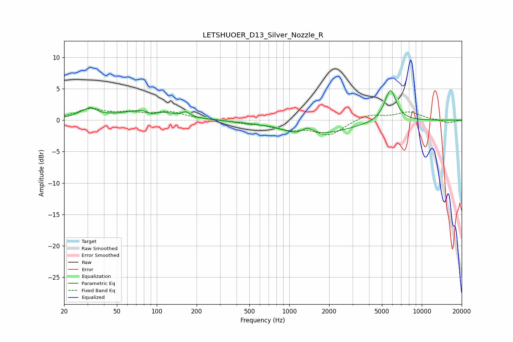

# LETSHUOER_D13_Silver_Nozzle_R
See [usage instructions](https://github.com/jaakkopasanen/AutoEq#usage) for more options and info.

### Parametric EQs
Apply preamp of -4.8 dB when using parametric equalizer.

|   # | Type    |   Fc (Hz) |    Q |   Gain (dB) |
|-----|---------|-----------|------|-------------|
|   1 | Peaking |        29 | 4.54 |        -0.6 |
|   2 | Peaking |        30 | 2.51 |         2.1 |
|   3 | Peaking |        85 | 0.78 |         1.6 |
|   4 | Peaking |        92 | 4.69 |        -0.6 |
|   5 | Peaking |       166 | 5.09 |         0.7 |
|   6 | Peaking |       383 | 1.68 |        -0.1 |
|   7 | Peaking |      1223 | 1.58 |        -0.7 |
|   8 | Peaking |      1364 | 3.23 |         1.3 |
|   9 | Peaking |      1636 | 0.57 |        -2.1 |
|  10 | Peaking |      5797 | 3.13 |         5.1 |

### Fixed Band EQs
When using fixed band (also called graphic) equalizer, apply preamp of **-2.0 dB** (if available) and set gains manually with these parameters.

|   # | Type    |   Fc (Hz) |    Q |   Gain (dB) |
|-----|---------|-----------|------|-------------|
|   1 | Peaking |        31 | 1.41 |         1.6 |
|   2 | Peaking |        62 | 1.41 |         0.9 |
|   3 | Peaking |       125 | 1.41 |         1.2 |
|   4 | Peaking |       250 | 1.41 |         0.1 |
|   5 | Peaking |       500 | 1.41 |        -0.5 |
|   6 | Peaking |      1000 | 1.41 |        -1.2 |
|   7 | Peaking |      2000 | 1.41 |        -2.3 |
|   8 | Peaking |      4000 | 1.41 |         1   |
|   9 | Peaking |      8000 | 1.41 |         1.3 |
|  10 | Peaking |     16000 | 1.41 |        -0.5 |

### Graphs

