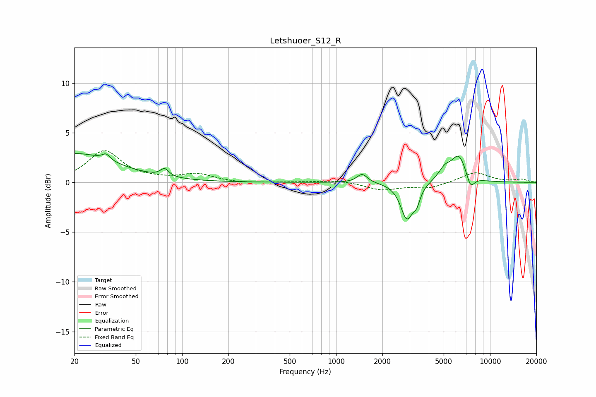

# Letshuoer_S12_R
See [usage instructions](https://github.com/jaakkopasanen/AutoEq#usage) for more options and info.

### Parametric EQs
Apply preamp of -3.0 dB when using parametric equalizer.

|   # | Type    |   Fc (Hz) |    Q |   Gain (dB) |
|-----|---------|-----------|------|-------------|
|   1 | Peaking |        20 | 0.54 |         2.9 |
|   2 | Peaking |        32 | 5.89 |         2.4 |
|   3 | Peaking |        32 | 5.94 |        -1.8 |
|   4 | Peaking |        77 | 5.37 |         0.8 |
|   5 | Peaking |      1478 | 4.19 |         0.9 |
|   6 | Peaking |      2879 | 3.56 |        -3.5 |
|   7 | Peaking |      3333 | 6    |        -1.3 |
|   8 | Peaking |      5076 | 3.35 |         1.1 |
|   9 | Peaking |      6274 | 2.77 |         2.6 |
|  10 | Peaking |      7466 | 5.08 |        -1.4 |

### Fixed Band EQs
When using fixed band (also called graphic) equalizer, apply preamp of **-3.3 dB** (if available) and set gains manually with these parameters.

|   # | Type    |   Fc (Hz) |    Q |   Gain (dB) |
|-----|---------|-----------|------|-------------|
|   1 | Peaking |        31 | 1.41 |         3.1 |
|   2 | Peaking |        62 | 1.41 |         0.2 |
|   3 | Peaking |       125 | 1.41 |         0.8 |
|   4 | Peaking |       250 | 1.41 |        -0.1 |
|   5 | Peaking |       500 | 1.41 |         0   |
|   6 | Peaking |      1000 | 1.41 |         0.2 |
|   7 | Peaking |      2000 | 1.41 |        -0.7 |
|   8 | Peaking |      4000 | 1.41 |        -0.6 |
|   9 | Peaking |      8000 | 1.41 |         1   |
|  10 | Peaking |     16000 | 1.41 |         0.3 |

### Graphs

