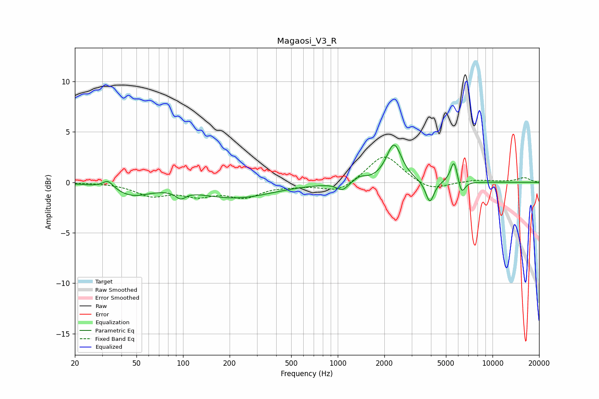

# Magaosi_V3_R
See [usage instructions](https://github.com/jaakkopasanen/AutoEq#usage) for more options and info.

### Parametric EQs
Apply preamp of -3.8 dB when using parametric equalizer.

|   # | Type    |   Fc (Hz) |    Q |   Gain (dB) |
|-----|---------|-----------|------|-------------|
|   1 | Peaking |        33 | 4.21 |         0.8 |
|   2 | Peaking |        47 | 1.23 |        -1.1 |
|   3 | Peaking |        97 | 4.4  |        -0.7 |
|   4 | Peaking |       219 | 0.59 |        -1.5 |
|   5 | Peaking |      1070 | 4    |        -0.8 |
|   6 | Peaking |      1390 | 3.73 |         0.5 |
|   7 | Peaking |      2310 | 2.9  |         3.8 |
|   8 | Peaking |      3936 | 5.27 |        -2.2 |
|   9 | Peaking |      5641 | 6    |         2.3 |
|  10 | Peaking |      6302 | 6    |        -1.5 |

### Fixed Band EQs
When using fixed band (also called graphic) equalizer, apply preamp of **-2.6 dB** (if available) and set gains manually with these parameters.

|   # | Type    |   Fc (Hz) |    Q |   Gain (dB) |
|-----|---------|-----------|------|-------------|
|   1 | Peaking |        31 | 1.41 |         0   |
|   2 | Peaking |        62 | 1.41 |        -1.2 |
|   3 | Peaking |       125 | 1.41 |        -1.1 |
|   4 | Peaking |       250 | 1.41 |        -1.3 |
|   5 | Peaking |       500 | 1.41 |        -0.2 |
|   6 | Peaking |      1000 | 1.41 |        -1   |
|   7 | Peaking |      2000 | 1.41 |         2.8 |
|   8 | Peaking |      4000 | 1.41 |        -0.9 |
|   9 | Peaking |      8000 | 1.41 |         0.2 |
|  10 | Peaking |     16000 | 1.41 |         0.5 |

### Graphs

