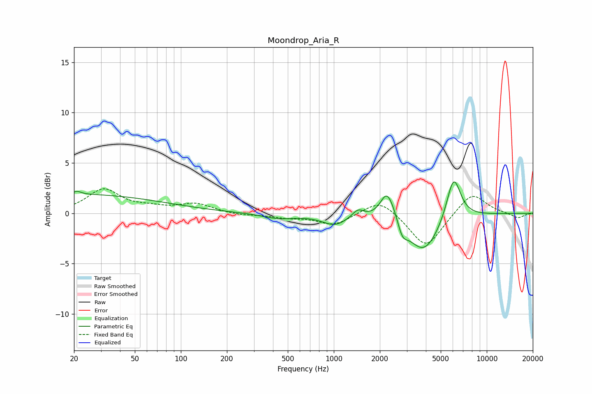

# Moondrop_Aria_R
See [usage instructions](https://github.com/jaakkopasanen/AutoEq#usage) for more options and info.

### Parametric EQs
Apply preamp of -3.2 dB when using parametric equalizer.

|   # | Type    |   Fc (Hz) |    Q |   Gain (dB) |
|-----|---------|-----------|------|-------------|
|   1 | Peaking |        20 | 0.23 |         1.9 |
|   2 | Peaking |        21 | 5.96 |         0.3 |
|   3 | Peaking |       435 | 1.31 |        -0.5 |
|   4 | Peaking |      1013 | 1.71 |        -1.1 |
|   5 | Peaking |      1438 | 3.81 |         0.8 |
|   6 | Peaking |      2215 | 3.32 |         2.5 |
|   7 | Peaking |      2483 | 3.05 |         0.8 |
|   8 | Peaking |      2799 | 4.34 |        -1.5 |
|   9 | Peaking |      3869 | 1.34 |        -3.9 |
|  10 | Peaking |      6070 | 2.95 |         4.4 |

### Fixed Band EQs
When using fixed band (also called graphic) equalizer, apply preamp of **-2.5 dB** (if available) and set gains manually with these parameters.

|   # | Type    |   Fc (Hz) |    Q |   Gain (dB) |
|-----|---------|-----------|------|-------------|
|   1 | Peaking |        31 | 1.41 |         2.3 |
|   2 | Peaking |        62 | 1.41 |         0.4 |
|   3 | Peaking |       125 | 1.41 |         0.9 |
|   4 | Peaking |       250 | 1.41 |        -0.2 |
|   5 | Peaking |       500 | 1.41 |        -0.4 |
|   6 | Peaking |      1000 | 1.41 |        -1.2 |
|   7 | Peaking |      2000 | 1.41 |         1.5 |
|   8 | Peaking |      4000 | 1.41 |        -3.5 |
|   9 | Peaking |      8000 | 1.41 |         2.2 |
|  10 | Peaking |     16000 | 1.41 |        -0.5 |

### Graphs

