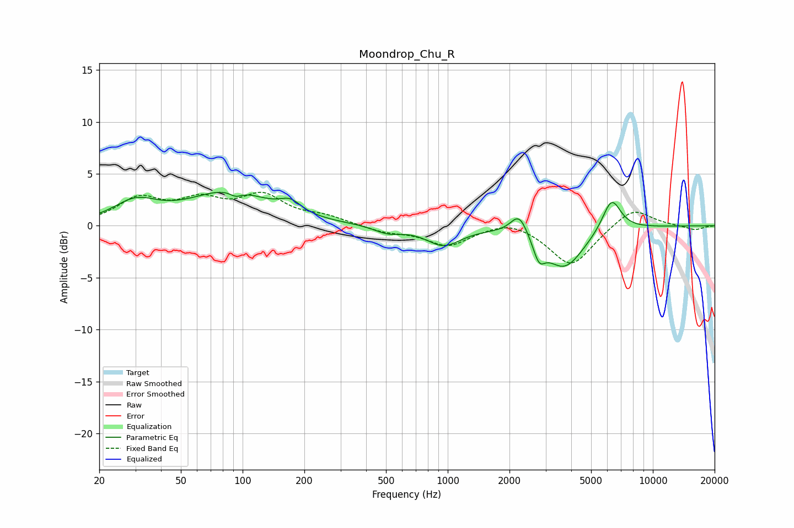

# Moondrop_Chu_R
See [usage instructions](https://github.com/jaakkopasanen/AutoEq#usage) for more options and info.

### Parametric EQs
Apply preamp of -3.3 dB when using parametric equalizer.

|   # | Type    |   Fc (Hz) |    Q |   Gain (dB) |
|-----|---------|-----------|------|-------------|
|   1 | Peaking |        30 | 1.35 |         2   |
|   2 | Peaking |        87 | 0.73 |         3.2 |
|   3 | Peaking |        93 | 4.8  |        -0.5 |
|   4 | Peaking |       171 | 2.75 |         1.1 |
|   5 | Peaking |       510 | 2.12 |        -0.7 |
|   6 | Peaking |       954 | 1.68 |        -1.8 |
|   7 | Peaking |      2233 | 3.33 |         2.2 |
|   8 | Peaking |      2786 | 4.9  |        -1.9 |
|   9 | Peaking |      3700 | 1.46 |        -4   |
|  10 | Peaking |      6291 | 3.02 |         3.2 |

### Fixed Band EQs
When using fixed band (also called graphic) equalizer, apply preamp of **-3.3 dB** (if available) and set gains manually with these parameters.

|   # | Type    |   Fc (Hz) |    Q |   Gain (dB) |
|-----|---------|-----------|------|-------------|
|   1 | Peaking |        31 | 1.41 |         2.4 |
|   2 | Peaking |        62 | 1.41 |         2.1 |
|   3 | Peaking |       125 | 1.41 |         2.6 |
|   4 | Peaking |       250 | 1.41 |         0.7 |
|   5 | Peaking |       500 | 1.41 |        -0.6 |
|   6 | Peaking |      1000 | 1.41 |        -1.9 |
|   7 | Peaking |      2000 | 1.41 |         0.8 |
|   8 | Peaking |      4000 | 1.41 |        -3.9 |
|   9 | Peaking |      8000 | 1.41 |         1.8 |
|  10 | Peaking |     16000 | 1.41 |        -0.4 |

### Graphs

