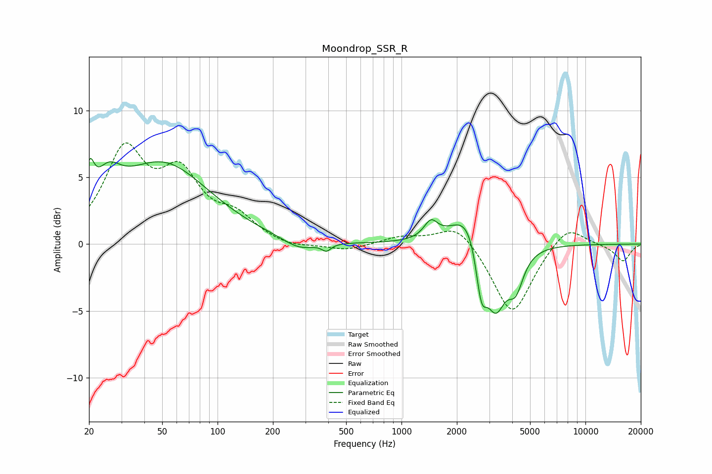

# Moondrop_SSR_R
See [usage instructions](https://github.com/jaakkopasanen/AutoEq#usage) for more options and info.

### Parametric EQs
Apply preamp of -6.5 dB when using parametric equalizer.

|   # | Type    |   Fc (Hz) |    Q |   Gain (dB) |
|-----|---------|-----------|------|-------------|
|   1 | Peaking |        20 | 5.94 |         2.7 |
|   2 | Peaking |        25 | 2.11 |         2.3 |
|   3 | Peaking |        50 | 0.56 |         5.9 |
|   4 | Peaking |       278 | 1.56 |        -0.8 |
|   5 | Peaking |       391 | 5.9  |        -0.5 |
|   6 | Peaking |      1444 | 3.81 |         1.3 |
|   7 | Peaking |      2355 | 1.52 |         3.1 |
|   8 | Peaking |      2715 | 4.66 |        -3.9 |
|   9 | Peaking |      3242 | 2.5  |        -5.1 |
|  10 | Peaking |      4180 | 3.35 |        -2.6 |

### Fixed Band EQs
When using fixed band (also called graphic) equalizer, apply preamp of **-7.7 dB** (if available) and set gains manually with these parameters.

|   # | Type    |   Fc (Hz) |    Q |   Gain (dB) |
|-----|---------|-----------|------|-------------|
|   1 | Peaking |        31 | 1.41 |         6.6 |
|   2 | Peaking |        62 | 1.41 |         4.6 |
|   3 | Peaking |       125 | 1.41 |         1.7 |
|   4 | Peaking |       250 | 1.41 |        -0.4 |
|   5 | Peaking |       500 | 1.41 |        -0.5 |
|   6 | Peaking |      1000 | 1.41 |         0.5 |
|   7 | Peaking |      2000 | 1.41 |         1.7 |
|   8 | Peaking |      4000 | 1.41 |        -5.4 |
|   9 | Peaking |      8000 | 1.41 |         1.6 |
|  10 | Peaking |     16000 | 1.41 |        -1.3 |

### Graphs

