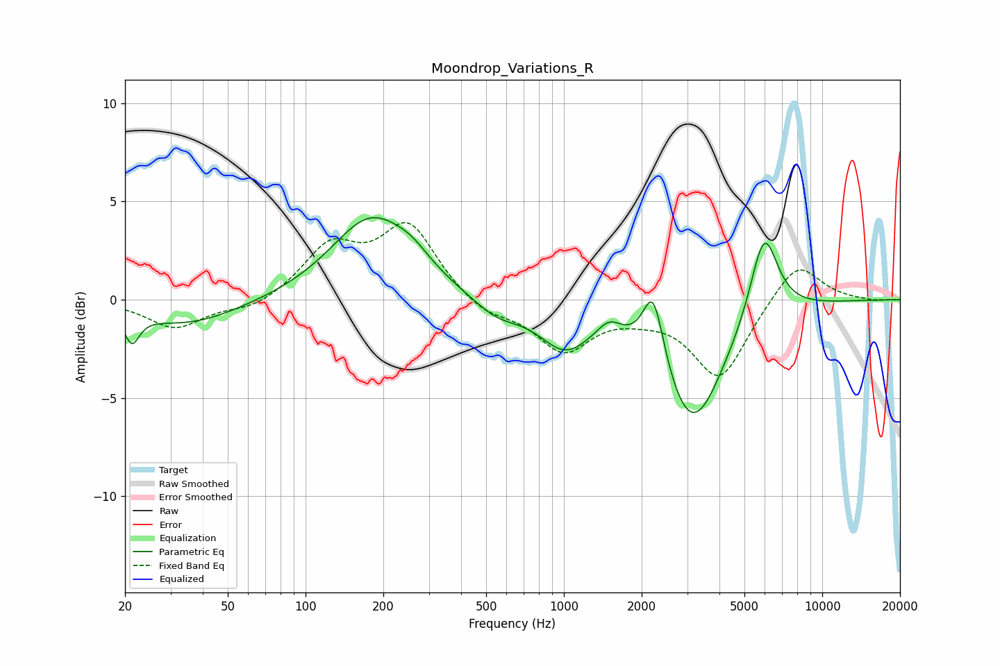

# Moondrop_Variations_R
See [usage instructions](https://github.com/jaakkopasanen/AutoEq#usage) for more options and info.

### Parametric EQs
Apply preamp of -4.3 dB when using parametric equalizer.

|   # | Type    |   Fc (Hz) |    Q |   Gain (dB) |
|-----|---------|-----------|------|-------------|
|   1 | Peaking |        21 | 5.01 |        -1.5 |
|   2 | Peaking |        35 | 0.7  |        -1.3 |
|   3 | Peaking |       179 | 0.92 |         4.1 |
|   4 | Peaking |       258 | 1.93 |         0.7 |
|   5 | Peaking |       549 | 1.55 |        -0.9 |
|   6 | Peaking |      1009 | 1.4  |        -2.2 |
|   7 | Peaking |      1496 | 3.09 |         0.8 |
|   8 | Peaking |      2219 | 3.49 |         3.6 |
|   9 | Peaking |      3142 | 1.15 |        -6.4 |
|  10 | Peaking |      5950 | 2.54 |         4.5 |

### Fixed Band EQs
When using fixed band (also called graphic) equalizer, apply preamp of **-4.0 dB** (if available) and set gains manually with these parameters.

|   # | Type    |   Fc (Hz) |    Q |   Gain (dB) |
|-----|---------|-----------|------|-------------|
|   1 | Peaking |        31 | 1.41 |        -1.4 |
|   2 | Peaking |        62 | 1.41 |        -0.5 |
|   3 | Peaking |       125 | 1.41 |         2.6 |
|   4 | Peaking |       250 | 1.41 |         3.7 |
|   5 | Peaking |       500 | 1.41 |        -0.8 |
|   6 | Peaking |      1000 | 1.41 |        -2.5 |
|   7 | Peaking |      2000 | 1.41 |        -0.4 |
|   8 | Peaking |      4000 | 1.41 |        -4   |
|   9 | Peaking |      8000 | 1.41 |         2.1 |
|  10 | Peaking |     16000 | 1.41 |        -0.1 |

### Graphs

