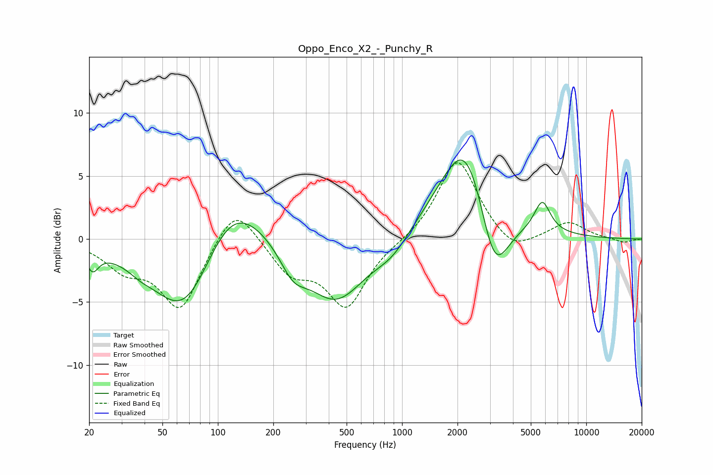

# Oppo_Enco_X2_-_Punchy_R
See [usage instructions](https://github.com/jaakkopasanen/AutoEq#usage) for more options and info.

### Parametric EQs
Apply preamp of -6.4 dB when using parametric equalizer.

|   # | Type    |   Fc (Hz) |    Q |   Gain (dB) |
|-----|---------|-----------|------|-------------|
|   1 | Peaking |        21 | 4.41 |        -1.6 |
|   2 | Peaking |        38 | 2.57 |        -0.4 |
|   3 | Peaking |        67 | 0.78 |        -7.7 |
|   4 | Peaking |       115 | 0.76 |         5.8 |
|   5 | Peaking |       256 | 1.97 |        -2   |
|   6 | Peaking |       436 | 0.87 |        -5.1 |
|   7 | Peaking |       884 | 1.51 |        -1.2 |
|   8 | Peaking |      2259 | 0.96 |         9.4 |
|   9 | Peaking |      3149 | 1.62 |        -7.2 |
|  10 | Peaking |      5772 | 3.2  |         2.5 |

### Fixed Band EQs
When using fixed band (also called graphic) equalizer, apply preamp of **-6.1 dB** (if available) and set gains manually with these parameters.

|   # | Type    |   Fc (Hz) |    Q |   Gain (dB) |
|-----|---------|-----------|------|-------------|
|   1 | Peaking |        31 | 1.41 |        -2   |
|   2 | Peaking |        62 | 1.41 |        -5.5 |
|   3 | Peaking |       125 | 1.41 |         3.2 |
|   4 | Peaking |       250 | 1.41 |        -2.5 |
|   5 | Peaking |       500 | 1.41 |        -5.2 |
|   6 | Peaking |      1000 | 1.41 |        -0.2 |
|   7 | Peaking |      2000 | 1.41 |         6.5 |
|   8 | Peaking |      4000 | 1.41 |        -1.4 |
|   9 | Peaking |      8000 | 1.41 |         1.3 |
|  10 | Peaking |     16000 | 1.41 |        -0.3 |

### Graphs

