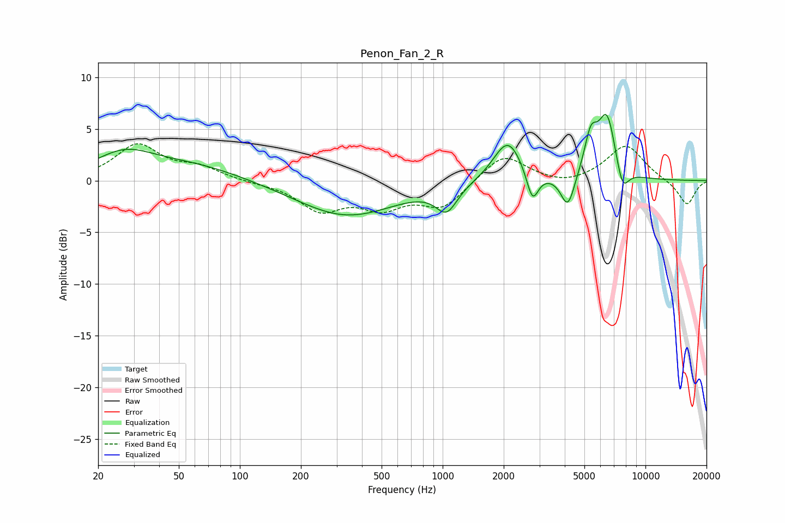

# Penon_Fan_2_R
See [usage instructions](https://github.com/jaakkopasanen/AutoEq#usage) for more options and info.

### Parametric EQs
Apply preamp of -6.5 dB when using parametric equalizer.

|   # | Type    |   Fc (Hz) |    Q |   Gain (dB) |
|-----|---------|-----------|------|-------------|
|   1 | Peaking |        27 | 0.98 |         2.3 |
|   2 | Peaking |        57 | 0.55 |         1.5 |
|   3 | Peaking |       335 | 0.57 |        -3.4 |
|   4 | Peaking |      1046 | 2.69 |        -2.5 |
|   5 | Peaking |      2097 | 1.98 |         4.1 |
|   6 | Peaking |      2772 | 4.83 |        -3   |
|   7 | Peaking |      4143 | 4.06 |        -3.3 |
|   8 | Peaking |      5376 | 4.27 |         3.5 |
|   9 | Peaking |      6464 | 3.01 |         6.2 |
|  10 | Peaking |      7690 | 4.25 |        -2.6 |

### Fixed Band EQs
When using fixed band (also called graphic) equalizer, apply preamp of **-3.7 dB** (if available) and set gains manually with these parameters.

|   # | Type    |   Fc (Hz) |    Q |   Gain (dB) |
|-----|---------|-----------|------|-------------|
|   1 | Peaking |        31 | 1.41 |         3.4 |
|   2 | Peaking |        62 | 1.41 |         1.1 |
|   3 | Peaking |       125 | 1.41 |        -0.2 |
|   4 | Peaking |       250 | 1.41 |        -2.7 |
|   5 | Peaking |       500 | 1.41 |        -2.3 |
|   6 | Peaking |      1000 | 1.41 |        -2.5 |
|   7 | Peaking |      2000 | 1.41 |         2.7 |
|   8 | Peaking |      4000 | 1.41 |        -0.5 |
|   9 | Peaking |      8000 | 1.41 |         3.5 |
|  10 | Peaking |     16000 | 1.41 |        -2.4 |

### Graphs

