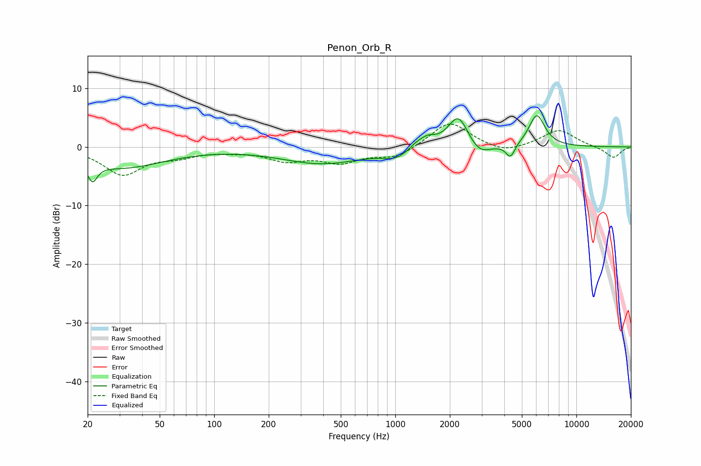

# Penon_Orb_R
See [usage instructions](https://github.com/jaakkopasanen/AutoEq#usage) for more options and info.

### Parametric EQs
Apply preamp of -5.4 dB when using parametric equalizer.

|   # | Type    |   Fc (Hz) |    Q |   Gain (dB) |
|-----|---------|-----------|------|-------------|
|   1 | Peaking |        21 | 5.47 |        -3   |
|   2 | Peaking |        31 | 0.59 |        -3.5 |
|   3 | Peaking |       394 | 0.62 |        -2.8 |
|   4 | Peaking |      1019 | 1.87 |        -1.4 |
|   5 | Peaking |      1298 | 3.43 |         0.9 |
|   6 | Peaking |      1508 | 3.25 |         1.5 |
|   7 | Peaking |      2230 | 2.44 |         5.7 |
|   8 | Peaking |      2896 | 2.27 |        -2.2 |
|   9 | Peaking |      4323 | 5.67 |        -2.3 |
|  10 | Peaking |      6048 | 3.11 |         5.4 |

### Fixed Band EQs
When using fixed band (also called graphic) equalizer, apply preamp of **-4.0 dB** (if available) and set gains manually with these parameters.

|   # | Type    |   Fc (Hz) |    Q |   Gain (dB) |
|-----|---------|-----------|------|-------------|
|   1 | Peaking |        31 | 1.41 |        -4.6 |
|   2 | Peaking |        62 | 1.41 |        -1.3 |
|   3 | Peaking |       125 | 1.41 |        -0.5 |
|   4 | Peaking |       250 | 1.41 |        -2.1 |
|   5 | Peaking |       500 | 1.41 |        -2.4 |
|   6 | Peaking |      1000 | 1.41 |        -1.8 |
|   7 | Peaking |      2000 | 1.41 |         4.4 |
|   8 | Peaking |      4000 | 1.41 |        -1.3 |
|   9 | Peaking |      8000 | 1.41 |         2.9 |
|  10 | Peaking |     16000 | 1.41 |        -1.9 |

### Graphs

