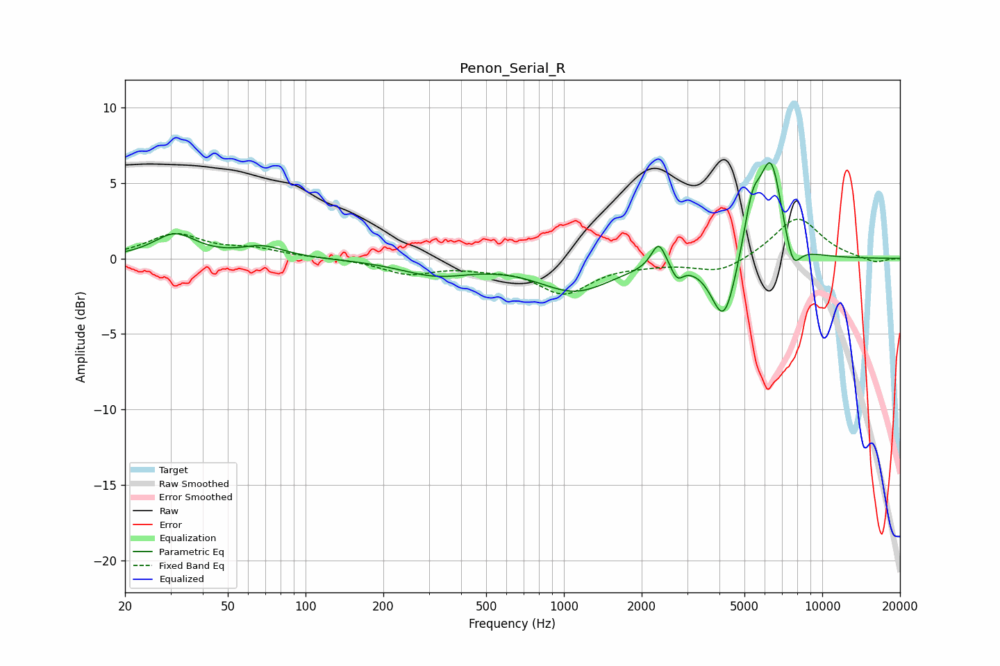

# Penon_Serial_R
See [usage instructions](https://github.com/jaakkopasanen/AutoEq#usage) for more options and info.

### Parametric EQs
Apply preamp of -6.4 dB when using parametric equalizer.

|   # | Type    |   Fc (Hz) |    Q |   Gain (dB) |
|-----|---------|-----------|------|-------------|
|   1 | Peaking |        31 | 1.77 |         1.6 |
|   2 | Peaking |        68 | 1.7  |         0.7 |
|   3 | Peaking |       319 | 1.02 |        -1   |
|   4 | Peaking |      1107 | 0.99 |        -2.1 |
|   5 | Peaking |      2328 | 5.01 |         1.8 |
|   6 | Peaking |      2743 | 6    |        -0.9 |
|   7 | Peaking |      4167 | 2.85 |        -4.5 |
|   8 | Peaking |      5355 | 4.07 |         3.2 |
|   9 | Peaking |      6337 | 3.01 |         6.4 |
|  10 | Peaking |      7678 | 4.35 |        -2.1 |

### Fixed Band EQs
When using fixed band (also called graphic) equalizer, apply preamp of **-2.7 dB** (if available) and set gains manually with these parameters.

|   # | Type    |   Fc (Hz) |    Q |   Gain (dB) |
|-----|---------|-----------|------|-------------|
|   1 | Peaking |        31 | 1.41 |         1.6 |
|   2 | Peaking |        62 | 1.41 |         0.5 |
|   3 | Peaking |       125 | 1.41 |         0   |
|   4 | Peaking |       250 | 1.41 |        -1   |
|   5 | Peaking |       500 | 1.41 |        -0.4 |
|   6 | Peaking |      1000 | 1.41 |        -2.2 |
|   7 | Peaking |      2000 | 1.41 |        -0.2 |
|   8 | Peaking |      4000 | 1.41 |        -1   |
|   9 | Peaking |      8000 | 1.41 |         2.8 |
|  10 | Peaking |     16000 | 1.41 |        -0.3 |

### Graphs

