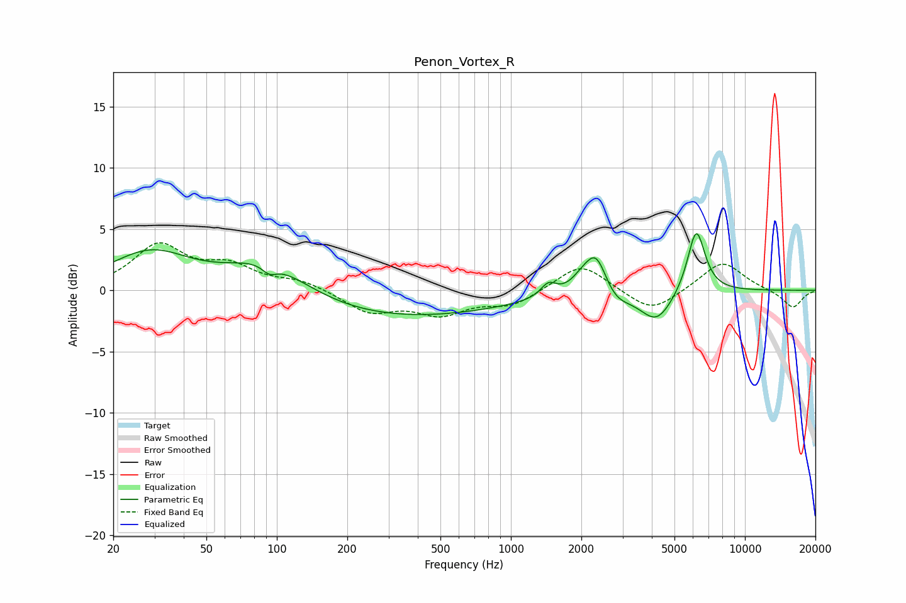

# Penon_Vortex_R
See [usage instructions](https://github.com/jaakkopasanen/AutoEq#usage) for more options and info.

### Parametric EQs
Apply preamp of -4.7 dB when using parametric equalizer.

|   # | Type    |   Fc (Hz) |    Q |   Gain (dB) |
|-----|---------|-----------|------|-------------|
|   1 | Peaking |        29 | 0.82 |         3.2 |
|   2 | Peaking |        91 | 0.75 |         3.5 |
|   3 | Peaking |        93 | 4.47 |        -0.8 |
|   4 | Peaking |       244 | 0.24 |        -2.5 |
|   5 | Peaking |      1448 | 4.29 |         1.1 |
|   6 | Peaking |      2010 | 2.98 |         0.9 |
|   7 | Peaking |      2316 | 3.04 |         3.2 |
|   8 | Peaking |      2781 | 2.37 |        -1.1 |
|   9 | Peaking |      4193 | 1.99 |        -2.6 |
|  10 | Peaking |      6193 | 3.63 |         5.3 |

### Fixed Band EQs
When using fixed band (also called graphic) equalizer, apply preamp of **-4.0 dB** (if available) and set gains manually with these parameters.

|   # | Type    |   Fc (Hz) |    Q |   Gain (dB) |
|-----|---------|-----------|------|-------------|
|   1 | Peaking |        31 | 1.41 |         3.5 |
|   2 | Peaking |        62 | 1.41 |         1.7 |
|   3 | Peaking |       125 | 1.41 |         0.7 |
|   4 | Peaking |       250 | 1.41 |        -1.7 |
|   5 | Peaking |       500 | 1.41 |        -1.8 |
|   6 | Peaking |      1000 | 1.41 |        -1.2 |
|   7 | Peaking |      2000 | 1.41 |         2.3 |
|   8 | Peaking |      4000 | 1.41 |        -1.9 |
|   9 | Peaking |      8000 | 1.41 |         2.4 |
|  10 | Peaking |     16000 | 1.41 |        -1.5 |

### Graphs

