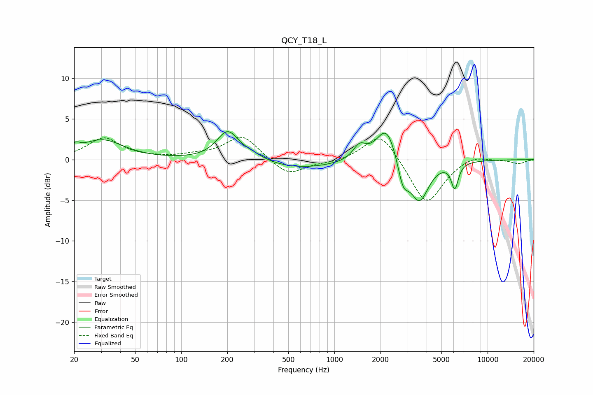

# QCY_T18_L
See [usage instructions](https://github.com/jaakkopasanen/AutoEq#usage) for more options and info.

### Parametric EQs
Apply preamp of -3.5 dB when using parametric equalizer.

|   # | Type    |   Fc (Hz) |    Q |   Gain (dB) |
|-----|---------|-----------|------|-------------|
|   1 | Peaking |        20 | 5.23 |         0.8 |
|   2 | Peaking |        30 | 1.03 |         2.4 |
|   3 | Peaking |       201 | 1.98 |         3.5 |
|   4 | Peaking |       292 | 1.83 |         0.7 |
|   5 | Peaking |       584 | 0.54 |        -1.1 |
|   6 | Peaking |      1459 | 3.41 |         1.7 |
|   7 | Peaking |      2199 | 2.09 |         4.6 |
|   8 | Peaking |      2806 | 3.95 |        -3.2 |
|   9 | Peaking |      3587 | 2.29 |        -5.1 |
|  10 | Peaking |      6107 | 6    |        -3.1 |

### Fixed Band EQs
When using fixed band (also called graphic) equalizer, apply preamp of **-2.8 dB** (if available) and set gains manually with these parameters.

|   # | Type    |   Fc (Hz) |    Q |   Gain (dB) |
|-----|---------|-----------|------|-------------|
|   1 | Peaking |        31 | 1.41 |         2.6 |
|   2 | Peaking |        62 | 1.41 |         0.1 |
|   3 | Peaking |       125 | 1.41 |         0.4 |
|   4 | Peaking |       250 | 1.41 |         3   |
|   5 | Peaking |       500 | 1.41 |        -2   |
|   6 | Peaking |      1000 | 1.41 |        -0.3 |
|   7 | Peaking |      2000 | 1.41 |         3.6 |
|   8 | Peaking |      4000 | 1.41 |        -5.7 |
|   9 | Peaking |      8000 | 1.41 |         0.7 |
|  10 | Peaking |     16000 | 1.41 |        -0.5 |

### Graphs

