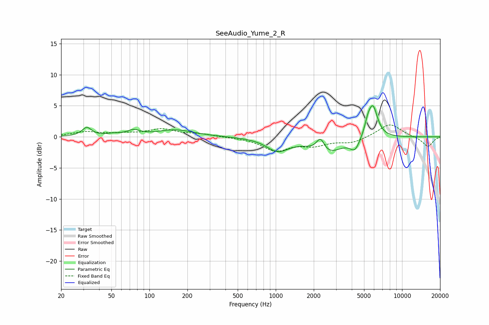

# SeeAudio_Yume_2_R
See [usage instructions](https://github.com/jaakkopasanen/AutoEq#usage) for more options and info.

### Parametric EQs
Apply preamp of -5.1 dB when using parametric equalizer.

|   # | Type    |   Fc (Hz) |    Q |   Gain (dB) |
|-----|---------|-----------|------|-------------|
|   1 | Peaking |        32 | 3.85 |         1.4 |
|   2 | Peaking |        51 | 2.58 |         0.3 |
|   3 | Peaking |        75 | 2.85 |         0.8 |
|   4 | Peaking |       161 | 0.97 |         1.1 |
|   5 | Peaking |      1036 | 1.61 |        -2.1 |
|   6 | Peaking |      2259 | 4.42 |         2.2 |
|   7 | Peaking |      2548 | 1.22 |        -2.6 |
|   8 | Peaking |      4238 | 3.69 |        -1.9 |
|   9 | Peaking |      5347 | 5.84 |         1.4 |
|  10 | Peaking |      5872 | 3.64 |         5.1 |

### Fixed Band EQs
When using fixed band (also called graphic) equalizer, apply preamp of **-2.0 dB** (if available) and set gains manually with these parameters.

|   # | Type    |   Fc (Hz) |    Q |   Gain (dB) |
|-----|---------|-----------|------|-------------|
|   1 | Peaking |        31 | 1.41 |         0.7 |
|   2 | Peaking |        62 | 1.41 |         0.4 |
|   3 | Peaking |       125 | 1.41 |         1.2 |
|   4 | Peaking |       250 | 1.41 |         0.4 |
|   5 | Peaking |       500 | 1.41 |        -0.1 |
|   6 | Peaking |      1000 | 1.41 |        -2.1 |
|   7 | Peaking |      2000 | 1.41 |        -1.2 |
|   8 | Peaking |      4000 | 1.41 |        -0.9 |
|   9 | Peaking |      8000 | 1.41 |         2.2 |
|  10 | Peaking |     16000 | 1.41 |        -1.6 |

### Graphs

