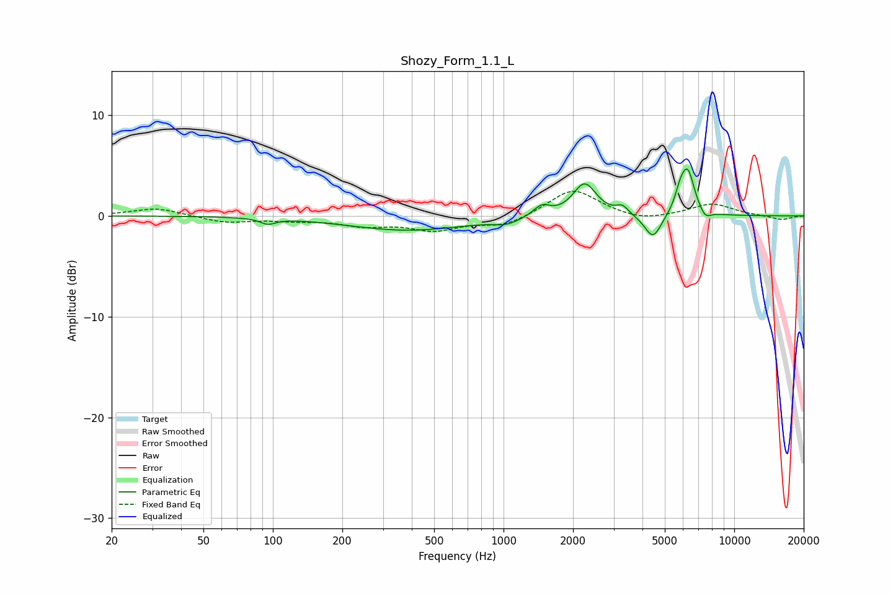

# Shozy_Form_1.1_L
See [usage instructions](https://github.com/jaakkopasanen/AutoEq#usage) for more options and info.

### Parametric EQs
Apply preamp of -4.8 dB when using parametric equalizer.

|   # | Type    |   Fc (Hz) |    Q |   Gain (dB) |
|-----|---------|-----------|------|-------------|
|   1 | Peaking |        95 | 4.4  |        -0.6 |
|   2 | Peaking |       386 | 0.54 |        -1.4 |
|   3 | Peaking |      1026 | 2.61 |        -0.5 |
|   4 | Peaking |      1462 | 3.95 |         1.1 |
|   5 | Peaking |      2246 | 2.8  |         3.3 |
|   6 | Peaking |      3273 | 5.44 |         0.8 |
|   7 | Peaking |      4445 | 3.83 |        -2.5 |
|   8 | Peaking |      5841 | 5.92 |         1.6 |
|   9 | Peaking |      6297 | 4.66 |         4.1 |
|  10 | Peaking |      7486 | 5.68 |        -0.8 |

### Fixed Band EQs
When using fixed band (also called graphic) equalizer, apply preamp of **-2.5 dB** (if available) and set gains manually with these parameters.

|   # | Type    |   Fc (Hz) |    Q |   Gain (dB) |
|-----|---------|-----------|------|-------------|
|   1 | Peaking |        31 | 1.41 |         0.8 |
|   2 | Peaking |        62 | 1.41 |        -0.6 |
|   3 | Peaking |       125 | 1.41 |        -0.3 |
|   4 | Peaking |       250 | 1.41 |        -0.8 |
|   5 | Peaking |       500 | 1.41 |        -1.3 |
|   6 | Peaking |      1000 | 1.41 |        -1   |
|   7 | Peaking |      2000 | 1.41 |         2.7 |
|   8 | Peaking |      4000 | 1.41 |        -0.6 |
|   9 | Peaking |      8000 | 1.41 |         1.2 |
|  10 | Peaking |     16000 | 1.41 |        -0.4 |

### Graphs

