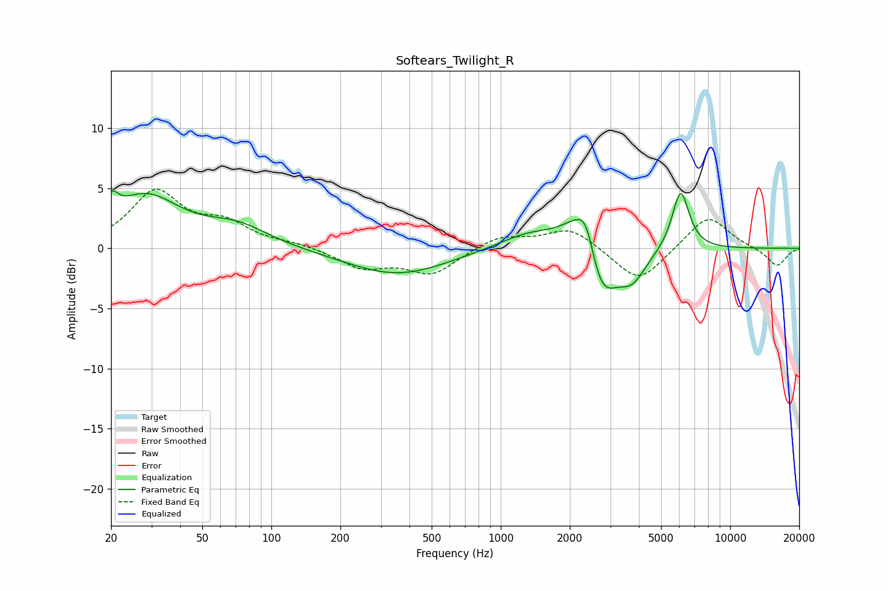

# Softears_Twilight_R
See [usage instructions](https://github.com/jaakkopasanen/AutoEq#usage) for more options and info.

### Parametric EQs
Apply preamp of -4.9 dB when using parametric equalizer.

|   # | Type    |   Fc (Hz) |    Q |   Gain (dB) |
|-----|---------|-----------|------|-------------|
|   1 | Peaking |        20 | 5.23 |         1.6 |
|   2 | Peaking |        28 | 0.93 |         4.2 |
|   3 | Peaking |        71 | 1.02 |         1.6 |
|   4 | Peaking |       355 | 0.64 |        -2.2 |
|   5 | Peaking |      1358 | 0.98 |         1.5 |
|   6 | Peaking |      2166 | 1.86 |         2.7 |
|   7 | Peaking |      2365 | 3.68 |         2.9 |
|   8 | Peaking |      2714 | 2.06 |        -5.1 |
|   9 | Peaking |      3737 | 2.26 |        -2.4 |
|  10 | Peaking |      6083 | 3.68 |         5   |

### Fixed Band EQs
When using fixed band (also called graphic) equalizer, apply preamp of **-5.0 dB** (if available) and set gains manually with these parameters.

|   # | Type    |   Fc (Hz) |    Q |   Gain (dB) |
|-----|---------|-----------|------|-------------|
|   1 | Peaking |        31 | 1.41 |         4.6 |
|   2 | Peaking |        62 | 1.41 |         1.8 |
|   3 | Peaking |       125 | 1.41 |         0.3 |
|   4 | Peaking |       250 | 1.41 |        -1.6 |
|   5 | Peaking |       500 | 1.41 |        -2.1 |
|   6 | Peaking |      1000 | 1.41 |         1.1 |
|   7 | Peaking |      2000 | 1.41 |         1.7 |
|   8 | Peaking |      4000 | 1.41 |        -3   |
|   9 | Peaking |      8000 | 1.41 |         2.8 |
|  10 | Peaking |     16000 | 1.41 |        -1.5 |

### Graphs

