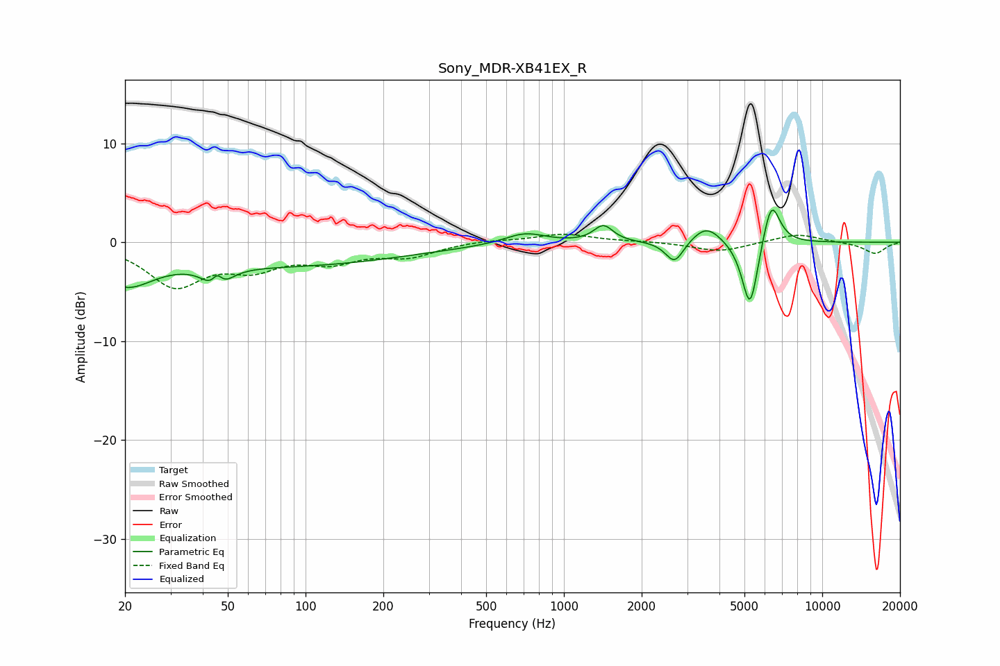

# Sony_MDR-XB41EX_R
See [usage instructions](https://github.com/jaakkopasanen/AutoEq#usage) for more options and info.

### Parametric EQs
Apply preamp of -3.3 dB when using parametric equalizer.

|   # | Type    |   Fc (Hz) |    Q |   Gain (dB) |
|-----|---------|-----------|------|-------------|
|   1 | Peaking |        20 | 1.27 |        -3.6 |
|   2 | Peaking |        45 | 3.75 |        -3.9 |
|   3 | Peaking |        46 | 6    |         3   |
|   4 | Peaking |        86 | 0.31 |        -2.3 |
|   5 | Peaking |       707 | 1.79 |         1.1 |
|   6 | Peaking |      1422 | 3.85 |         1.7 |
|   7 | Peaking |      2683 | 4.02 |        -2.3 |
|   8 | Peaking |      3568 | 2.46 |         1.8 |
|   9 | Peaking |      5255 | 4.4  |        -7.2 |
|  10 | Peaking |      6351 | 4.12 |         4.7 |

### Fixed Band EQs
When using fixed band (also called graphic) equalizer, apply preamp of **-0.9 dB** (if available) and set gains manually with these parameters.

|   # | Type    |   Fc (Hz) |    Q |   Gain (dB) |
|-----|---------|-----------|------|-------------|
|   1 | Peaking |        31 | 1.41 |        -4.2 |
|   2 | Peaking |        62 | 1.41 |        -2.2 |
|   3 | Peaking |       125 | 1.41 |        -1.7 |
|   4 | Peaking |       250 | 1.41 |        -1.3 |
|   5 | Peaking |       500 | 1.41 |         0.2 |
|   6 | Peaking |      1000 | 1.41 |         0.8 |
|   7 | Peaking |      2000 | 1.41 |         0.1 |
|   8 | Peaking |      4000 | 1.41 |        -1   |
|   9 | Peaking |      8000 | 1.41 |         0.9 |
|  10 | Peaking |     16000 | 1.41 |        -1.2 |

### Graphs

