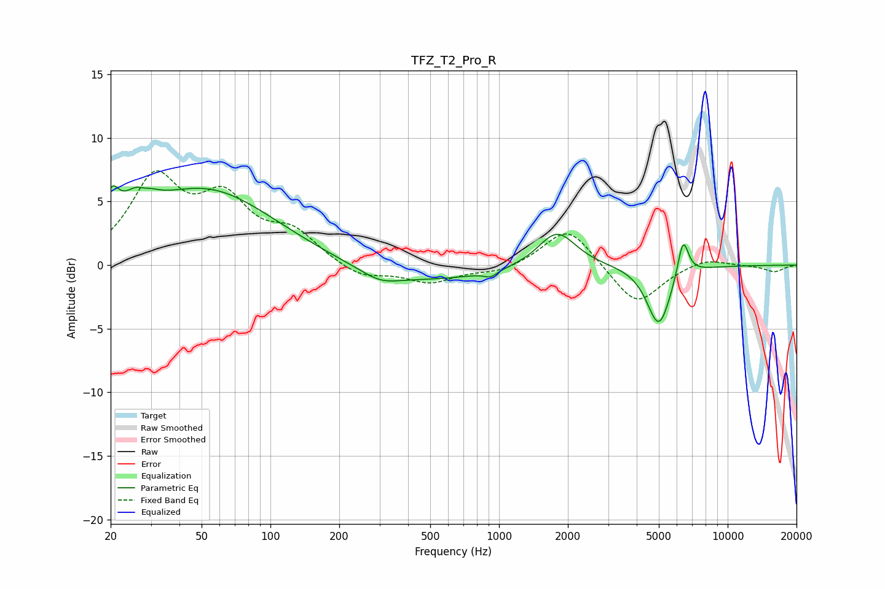

# TFZ_T2_Pro_R
See [usage instructions](https://github.com/jaakkopasanen/AutoEq#usage) for more options and info.

### Parametric EQs
Apply preamp of -6.3 dB when using parametric equalizer.

|   # | Type    |   Fc (Hz) |    Q |   Gain (dB) |
|-----|---------|-----------|------|-------------|
|   1 | Peaking |        20 | 4.55 |         2.5 |
|   2 | Peaking |        26 | 2.28 |         2.1 |
|   3 | Peaking |        28 | 5.84 |        -0.3 |
|   4 | Peaking |        52 | 0.47 |         5.9 |
|   5 | Peaking |       302 | 1.66 |        -0.8 |
|   6 | Peaking |       451 | 0.43 |        -1.3 |
|   7 | Peaking |       919 | 4.92 |        -0.5 |
|   8 | Peaking |      1792 | 1.72 |         2.9 |
|   9 | Peaking |      5000 | 2.68 |        -4.8 |
|  10 | Peaking |      6379 | 5.72 |         3.1 |

### Fixed Band EQs
When using fixed band (also called graphic) equalizer, apply preamp of **-7.5 dB** (if available) and set gains manually with these parameters.

|   # | Type    |   Fc (Hz) |    Q |   Gain (dB) |
|-----|---------|-----------|------|-------------|
|   1 | Peaking |        31 | 1.41 |         6.5 |
|   2 | Peaking |        62 | 1.41 |         4.6 |
|   3 | Peaking |       125 | 1.41 |         2.3 |
|   4 | Peaking |       250 | 1.41 |        -1.1 |
|   5 | Peaking |       500 | 1.41 |        -1.3 |
|   6 | Peaking |      1000 | 1.41 |        -0.6 |
|   7 | Peaking |      2000 | 1.41 |         3.1 |
|   8 | Peaking |      4000 | 1.41 |        -3.2 |
|   9 | Peaking |      8000 | 1.41 |         0.6 |
|  10 | Peaking |     16000 | 1.41 |        -0.5 |

### Graphs

