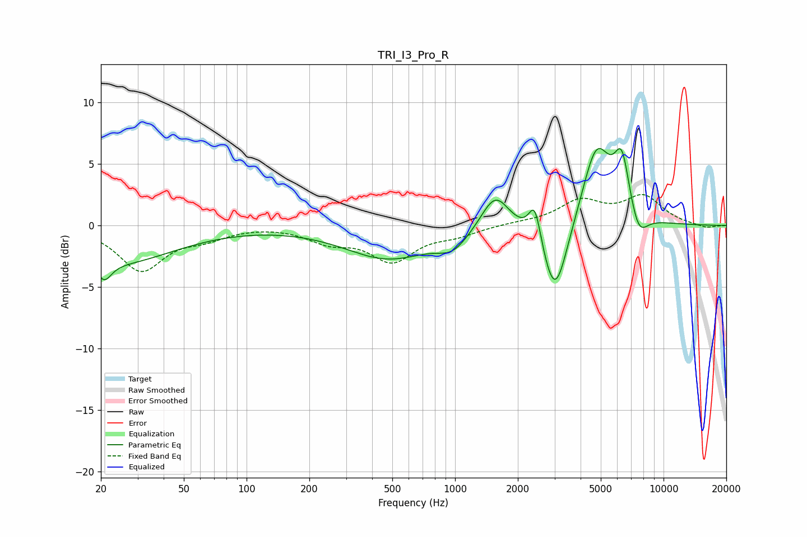

# TRI_I3_Pro_R
See [usage instructions](https://github.com/jaakkopasanen/AutoEq#usage) for more options and info.

### Parametric EQs
Apply preamp of -6.4 dB when using parametric equalizer.

|   # | Type    |   Fc (Hz) |    Q |   Gain (dB) |
|-----|---------|-----------|------|-------------|
|   1 | Peaking |        21 | 4.13 |        -1.5 |
|   2 | Peaking |        24 | 0.52 |        -2.9 |
|   3 | Peaking |       478 | 0.68 |        -2.6 |
|   4 | Peaking |       976 | 1.93 |        -1.3 |
|   5 | Peaking |      1559 | 2.08 |         3.1 |
|   6 | Peaking |      2414 | 4.9  |         3.1 |
|   7 | Peaking |      3017 | 2.3  |        -6.5 |
|   8 | Peaking |      4770 | 1.97 |         6.6 |
|   9 | Peaking |      6312 | 3.69 |         4.6 |
|  10 | Peaking |      7589 | 3.15 |        -2.1 |

### Fixed Band EQs
When using fixed band (also called graphic) equalizer, apply preamp of **-2.6 dB** (if available) and set gains manually with these parameters.

|   # | Type    |   Fc (Hz) |    Q |   Gain (dB) |
|-----|---------|-----------|------|-------------|
|   1 | Peaking |        31 | 1.41 |        -3.6 |
|   2 | Peaking |        62 | 1.41 |        -0.8 |
|   3 | Peaking |       125 | 1.41 |         0.1 |
|   4 | Peaking |       250 | 1.41 |        -1.2 |
|   5 | Peaking |       500 | 1.41 |        -2.7 |
|   6 | Peaking |      1000 | 1.41 |        -0.7 |
|   7 | Peaking |      2000 | 1.41 |         0.2 |
|   8 | Peaking |      4000 | 1.41 |         1.9 |
|   9 | Peaking |      8000 | 1.41 |         2.3 |
|  10 | Peaking |     16000 | 1.41 |        -0.2 |

### Graphs

