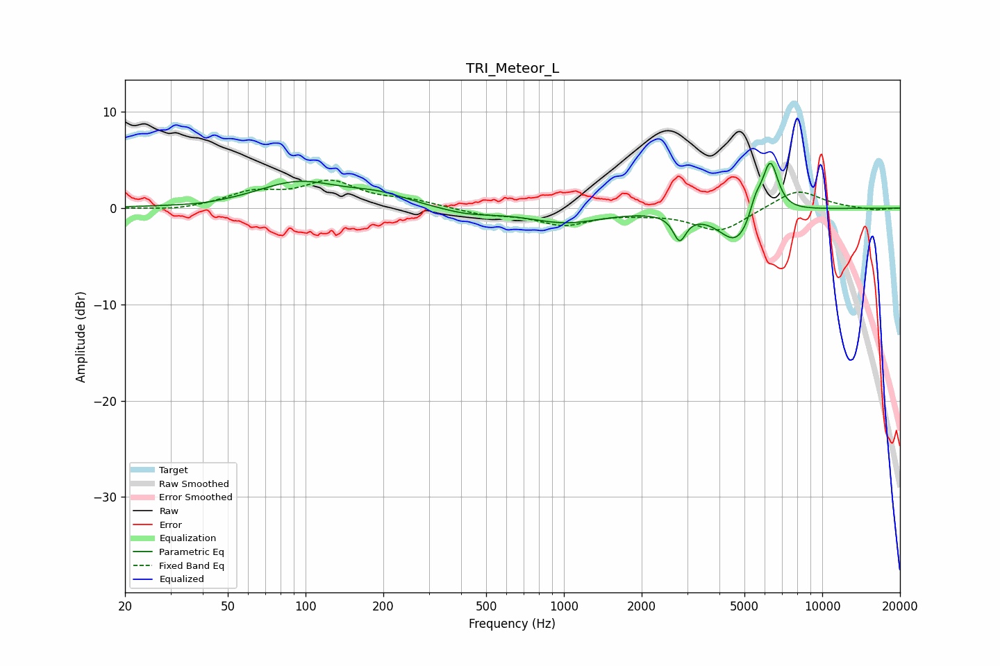

# TRI_Meteor_L
See [usage instructions](https://github.com/jaakkopasanen/AutoEq#usage) for more options and info.

### Parametric EQs
Apply preamp of -4.7 dB when using parametric equalizer.

|   # | Type    |   Fc (Hz) |    Q |   Gain (dB) |
|-----|---------|-----------|------|-------------|
|   1 | Peaking |        40 | 1.91 |        -0.1 |
|   2 | Peaking |        94 | 0.89 |         2.6 |
|   3 | Peaking |       192 | 1.18 |         1.1 |
|   4 | Peaking |       421 | 1.27 |        -0.6 |
|   5 | Peaking |      1017 | 0.98 |        -1.4 |
|   6 | Peaking |      2805 | 5.73 |        -2.7 |
|   7 | Peaking |      4669 | 2.02 |        -3.7 |
|   8 | Peaking |      5517 | 5.98 |         1.8 |
|   9 | Peaking |      6179 | 4.31 |         1.4 |
|  10 | Peaking |      6320 | 4.49 |         4.2 |

### Fixed Band EQs
When using fixed band (also called graphic) equalizer, apply preamp of **-3.0 dB** (if available) and set gains manually with these parameters.

|   # | Type    |   Fc (Hz) |    Q |   Gain (dB) |
|-----|---------|-----------|------|-------------|
|   1 | Peaking |        31 | 1.41 |        -0.3 |
|   2 | Peaking |        62 | 1.41 |         1.5 |
|   3 | Peaking |       125 | 1.41 |         2.6 |
|   4 | Peaking |       250 | 1.41 |         0.7 |
|   5 | Peaking |       500 | 1.41 |        -0.6 |
|   6 | Peaking |      1000 | 1.41 |        -1.6 |
|   7 | Peaking |      2000 | 1.41 |        -0.3 |
|   8 | Peaking |      4000 | 1.41 |        -2.4 |
|   9 | Peaking |      8000 | 1.41 |         2   |
|  10 | Peaking |     16000 | 1.41 |        -0.2 |

### Graphs

